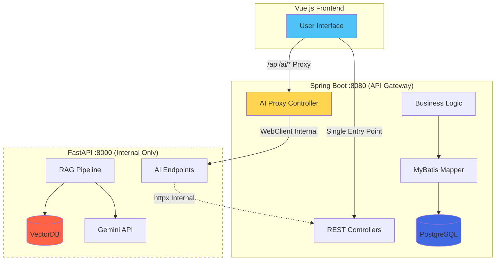

# Gaji - What If Storytelling Platform

AI 기반 대체 타임라인 스토리 탐험 플랫폼입니다. "가지(Branch)"라는 이름처럼 원작 소설에서 분기된 무한한 가능성의 What If 시나리오를 생성하고, AI 캐릭터와 대화하며 새로운 이야기를 탐험할 수 있습니다.

## Project Architecture

본 프로젝트는 API Gateway Architecture를 채택하여 AI 기반 RAG 시스템과 비즈니스 로직을 효과적으로 분리했습니다.

### Key Architectural Concepts

#### API Gateway Architecture

API Gateway 패턴을 통해 Spring Boot가 단일 진입점 역할을 하며 FastAPI는 내부 네트워크에서만 접근 가능합니다.



**Spring Boot (Port 8080) - API Gateway & Business Logic Server**:

- **Database Access**: PostgreSQL ONLY (via MyBatis)
- **Responsibilities**:
  - API Gateway: 모든 프론트엔드 요청의 단일 진입점
  - AI Proxy: FastAPI 엔드포인트 프록시 (외부 노출 방지)
  - 사용자 인증 및 권한 관리 (JWT)
  - 소설 메타데이터 CRUD (PostgreSQL)
  - 시나리오 CRUD (VectorDB document ID를 문자열로 저장)
  - 대화 CRUD (character_vectordb_id를 VARCHAR로 저장)
  - 소셜 기능 (팔로우, 좋아요, 메모)
  - Long polling 엔드포인트 (AI 작업 상태 확인)
  - 중앙화된 로깅 및 모니터링
- **Never accesses**: VectorDB (모든 VectorDB 쿼리는 FastAPI에 위임)

**FastAPI (Port 8000) - AI & VectorDB Server (Internal Network Only)**:

- **Database Access**: VectorDB ONLY (ChromaDB/Pinecone client)
- **External Exposure**: ❌ None (내부 Docker 네트워크에서만 접근 가능)
- **Responsibilities**:
  - 소설 수집 파이프라인 (텍스트 → VectorDB)
  - VectorDB CRUD 작업 (5개 컬렉션)
  - 의미론적 검색 (RAG 쿼리)
  - Gemini API 통합
  - 대화 생성 (Celery를 통한 비동기)
- **Never accesses**: PostgreSQL (Spring Boot API 호출을 통해 메타데이터 수신)

**Why Pattern B Was Chosen**:

1. **보안**: FastAPI 및 Gemini API 키의 외부 노출 방지
2. **단순성**: 프론트엔드가 하나의 API 클라이언트만 관리
3. **중앙화된 로깅**: 모든 요청이 Spring Boot를 통과하여 추적 및 모니터링 용이
4. **비용**: SSL 인증서/도메인 비용 절감 (연간 $700)
5. **성능**: +50ms 프록시 오버헤드는 5000ms AI 작업에서 무시 가능 (1%)

#### Hybrid Database Architecture

플랫폼은 **PostgreSQL (관계형 메타데이터)**과 **VectorDB (콘텐츠 및 임베딩)**를 분리하여 최적의 성능, 확장성 및 비용 효율성을 달성합니다.

| Aspect             | PostgreSQL                                      | VectorDB (ChromaDB/Pinecone)                 |
| ------------------ | ----------------------------------------------- | -------------------------------------------- |
| **Purpose**        | 관계형 메타데이터, 사용자 데이터, 비즈니스 로직 | 소설 콘텐츠, 임베딩, LLM 분석                |
| **Data Types**     | 사용자 계정, 시나리오, 대화, 소셜 그래프        | 전체 텍스트 구절, 캐릭터 설명, 의미론적 벡터 |
| **Query Patterns** | CRUD 작업, JOIN, 트랜잭션                       | 의미론적 검색, 유사도 쿼리, 임베딩 검색      |
| **Table Count**    | 15개 핵심 테이블                                | 5개 컬렉션                                   |
| **Storage Size**   | ~10GB (100만 사용자 기준)                       | ~100GB (1000개 소설 기준)                    |

#### What If Scenario Creation

사용자는 세 가지 유형의 What If 시나리오를 생성할 수 있습니다:

1. **캐릭터 속성 변경**: "만약 헤르미온느가 슬리데린에 배정되었다면?"
2. **이벤트 변경**: "만약 개츠비가 데이지를 만나지 않았다면?"
3. **설정 변경**: "만약 오만과 편견이 2024년 서울에서 일어났다면?"

**시나리오 템플릿 구조**:

```yaml
scenario_template:
  book_id: "uuid-harry-potter-philosophers-stone" # REQUIRED
  scenario_title: "Hermione in Slytherin"
  divergence_point: "Sorting Hat ceremony, Year 1"

  character_property_changes:
    - character_name: "Hermione Granger"
      house_assignment:
        original_value: "Gryffindor"
        changed_value: "Slytherin"
        reason: "Sorting Hat recognized her ambition"

  event_alterations_list:
    - event_name: "Troll Incident"
      original_event: "Harry and Ron save Hermione"
      alteration_type: "OUTCOME_CHANGED"
      altered_outcome: "Draco and Pansy save Hermione"

  setting_modifications_list: []
```

## Database Schema

### PostgreSQL Schema (Metadata - 15 Tables)

**Core Tables**:

- **users**: 사용자 계정
- **novels**: 소설 메타데이터 (콘텐츠 제외)
- **base_scenarios**: 기본 시나리오 (VectorDB passage ID 참조)
- **root_user_scenarios**: 사용자 생성 "What If" 시나리오
- **leaf_user_scenarios**: 포크된 시나리오 (depth 1)
- **scenario_character_changes**: 캐릭터 변경사항 (VectorDB 참조)
- **conversations**: ROOT-only 포킹 (parent_conversation_id)
- **conversation_message_links**: 메시지 재사용을 위한 조인 테이블
- **messages**: 대화 메시지

**Social Tables**:

- **user_follows**: 팔로우 관계
- **conversation_likes**: 대화 좋아요
- **book_likes**: 책 좋아요 (novels.like_count 자동 업데이트)
- **conversation_memos**: 대화 메모
- **book_comments**: 책 댓글

### VectorDB Schema (Content + Embeddings - 5 Collections)

1. **novel_passages**: 소설 텍스트 청크 + 의미론적 임베딩 (RAG용)
2. **characters**: 캐릭터 설명 + 성격 + 임베딩
3. **locations**: 배경 설명 + 임베딩
4. **events**: 주요 플롯 이벤트 + 의미론적 맥락
5. **themes**: 주제 분석 + 임베딩

**Cross-Database References**: PostgreSQL에 VectorDB document ID를 문자열로 저장하여 하이브리드 쿼리 지원

## Technology Stack

### Backend Framework

- **Spring Boot**: 3.x (API Gateway, Business Logic)
- **Java**: 17+
- **MyBatis**: 3.x (PostgreSQL SQL Mapper)
- **WebClient**: FastAPI 통신

### AI Backend

- **FastAPI**: 0.110+ (AI/RAG Service)
- **Python**: 3.11+
- **Celery**: 비동기 작업 큐
- **Redis**: 메시지 브로커

### Frontend

- **Vue.js**: 3.x (SPA Framework)
- **PrimeVue**: 3.x (UI Components)
- **PandaCSS**: latest (Styling)
- **Pinia**: State Management

### Database

- **PostgreSQL**: 15.x (메타데이터 전용, 15개 테이블)
- **ChromaDB**: latest (개발 환경, 5개 컬렉션)
- **Pinecone**: 프로덕션 환경 (5개 컬렉션)

### AI/ML

- **Gemini 2.5 Flash**: 텍스트 생성
- **Gemini Embedding API**: 768차원 임베딩

### Migration & Deployment

- **Flyway**: PostgreSQL 스키마 버전 관리
- **Railway**: 백엔드 서비스
- **Vercel**: 프론트엔드 CDN

## Project Structure

```
gaji/                      # 최상위 레포지토리 (Docker Compose 통합)
├── gajiBE/               # Spring Boot Backend (API Gateway) - Git Submodule
├── gajiAI/               # FastAPI AI Service - Git Submodule
├── gajiFE/               # Vue.js Frontend - Git Submodule
├── docker-compose.yml    # 통합 Docker Compose 설정
├── .env.example          # 환경변수 템플릿
├── architecture.md       # 시스템 아키텍처 문서
└── docs/                 # 상세 문서
    ├── PRD.md
    ├── ARCHITECTURE.md
    ├── DATABASE_STRATEGY.md
    ├── epics/            # 7개 Epic 명세
    └── stories/          # 41개 User Story 구현
```

## Core Features

### What If Scenario System

- **시나리오 생성**: 3가지 유형 (캐릭터/이벤트/설정) 선택
- **시나리오 탐색**: 책별, 인기도별, 유형별 필터링
- **시나리오 포킹**: 메타-시나리오 생성 (무한 분기)
- **검증 시스템**: GPT-4 mini를 통한 논리적 일관성 검사

### AI Character Conversations

- **동적 프롬프트 생성**: 시나리오 파라미터 기반 캐릭터 적응
- **RAG 통합**: VectorDB에서 관련 구절/캐릭터/이벤트 검색
- **Long Polling**: 2초마다 AI 작업 상태 확인
- **대화 포킹**: ROOT-only (parent_conversation_id = NULL), max depth = 1
- **메시지 복사**: 포킹 시 min(6, total_message_count) 메시지 복사

### Social Features

- **Book Likes**: 책 좋아요 (like_count 자동 집계)
- **Book Comments**: 책 댓글 시스템
- **Conversation Likes**: 대화 좋아요
- **User Follows**: 팔로우 관계
- **Conversation Memos**: 개인 메모

### Discovery & Visualization

- **다차원 검색**: 책별, 시나리오 유형별, 인기도별
- **시나리오 트리**: 재귀적 Vue 컴포넌트로 분기 구조 시각화
- **소셜 공유**: og:image 카드 자동 생성
- **큐레이션**: "Timeline of the Week" 에디토리얼 추천

## Architecture Highlights

### Triple-Redundancy Async Processing

대규모 트래픽 처리를 위한 3단계 병렬 처리:

1. **Thread Pool (Primary)**: 가장 빠른 응답 (5 workers)
2. **Celery (Secondary)**: Redis 기반 분산 작업 큐
3. **Kafka (Tertiary)**: 메시지 영속성 보장 (Consumer Group)

### Distributed Locking Strategy

Redis 분산 락으로 동시성 문제 해결:

- UUID 기반 소유권 검증
- 자동 TTL로 데드락 방지
- 사물함별 독립적인 락

### Blockchain-Based Audit Trail

Ethereum을 활용한 변조 불가능한 대여 이력 관리:

- 학생의 사물함 사용 이력을 블록체인에 영구 기록
- 대여/반납 시점의 변조 방지
- NFT 기반 디지털 증명서 발급

## Team

| Member     | GitHub                                       | Role           |
| ---------- | -------------------------------------------- | -------------- |
| **민영재** | [@yeomin4242](https://github.com/yeomin4242) | Core Developer |
| **구서원** | [@swkooo](https://github.com/swkooo)         | Core Developer |

## Acknowledgments

- **Inspiration**: What If...?, Archive of Our Own (AO3)
- **AI Models**: Gemini 2.5 Flash, Gemini Embedding API
- **UI Components**: PrimeVue, PandaCSS
- **Community**: BookTok creators, fanfiction writers, literature professors

---

<div align="center">

**🌿 Let's gaji some timelines! 🌿**

Made with ❤️ by the Gaji team

</div>
