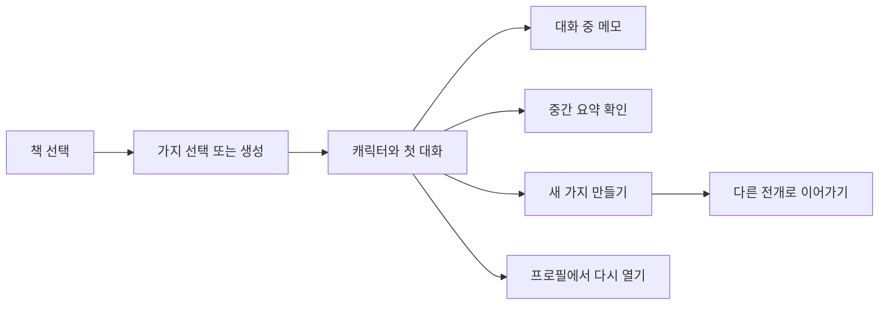

# Gaji

> Branch all of story

Gaji는 책 속 인물과 대화하다가, 대화 중 떠오른 "만약에?"를 새로운 이야기 가지로 이어갈 수 있는 AI 독서 서비스입니다.

- 서비스: [https://gaji.me](https://gaji.me)

## 한눈에 보기

Gaji는 독자가 책을 읽고 끝내는 대신, 원작의 장면을 바탕으로 다른 선택을 만들어보게 합니다.

사용자는 책을 고르고, 캐릭터와 대화하고, 흥미로운 지점에서 새 가지를 만듭니다. 만들어진 가지와 대화는 프로필에 남아 다음 방문에도 이어갈 수 있습니다.

## 화면 데모

### 인증과 첫 진입


### 가지 탐색과 시나리오 상세


### 캐릭터 대화와 메모


### 검색과 프로필


## 서비스 흐름



## 예시 흐름

사용자는 **오만과 편견**을 고르고 Elizabeth Bennet과 대화를 시작합니다.

대화 중 "Darcy가 더 일찍 고백했다면?"이라는 생각이 들면, 그 지점에서 새 가지를 만들 수 있습니다. 새 가지에서는 Darcy의 고백이 빨라진 세계를 기준으로 Elizabeth와 다시 대화합니다.

이 흐름이 Gaji의 핵심입니다. 사용자는 책을 읽는 데서 멈추지 않고, 원작을 바탕으로 다른 선택과 다른 대화를 직접 만들어갑니다.

## Gaji가 해결하는 문제

기존 독서·언어 학습 서비스는 보통 진도, 과제, 문제 풀이를 중심으로 움직입니다. 사용자는 책을 즐기기보다 정해진 단계를 끝내는 데 집중하게 됩니다.

반대로 많은 AI 캐릭터 채팅 서비스는 대화는 쉽지만, 다음에 다시 들어왔을 때 이전 흐름을 이어가기 어렵습니다. 대화가 쌓여도 "내가 만든 이야기"처럼 남지 않는 문제가 있습니다.

Gaji는 이 두 문제를 함께 다룹니다.

- 사용자가 책 속 인물과 먼저 대화합니다.
- 대화는 다음 방문에도 이어집니다.
- 흥미로운 지점에서 다른 선택지를 만들 수 있습니다.
- 만든 가지와 좋아요한 대화는 프로필에서 다시 열 수 있습니다.

## 핵심 기능

| 기능 | 사용자가 할 수 있는 일 |
| --- | --- |
| 책 선택 | 대화할 작품과 캐릭터를 고릅니다. |
| 가지 선택 또는 생성 | 원작 장면에서 바뀌는 조건을 만들거나 기존 가지를 선택합니다. |
| 캐릭터 대화 | 원작 맥락과 바뀐 가정을 반영한 캐릭터 답변을 받습니다. |
| 메모와 중간 요약 | 기억하고 싶은 해석을 남기고, 지금까지의 대화를 요약합니다. |
| 대화에서 새 가지 만들기 | 마음에 드는 지점에서 다른 질문과 선택으로 새 흐름을 이어갑니다. |
| 검색과 프로필 | 책, 가지, 대화, 사용자를 찾고 다시 이어갈 대화를 엽니다. |

## 누구를 위한 서비스인가

| 사용자 | 상황 | Gaji가 제공하는 것 |
| --- | --- | --- |
| 이야기를 다르게 해석하고 싶은 독자 | 좋아하는 작품의 다른 가능성을 상상하고 싶습니다. | 원작 장면을 바탕으로 What-if 가지를 만들고 캐릭터와 대화할 수 있습니다. |
| 읽기에 흥미를 붙이고 싶은 학생 | 긴 글을 혼자 읽기 어렵고, 흥미가 빨리 식습니다. | 책과 캐릭터를 고르면 바로 짧은 대화를 시작할 수 있습니다. |
| 의미 있는 독서 활동을 보고 싶은 보호자·교육자 | 단순한 화면 사용량이 아니라 읽기 활동이 이어지는지 확인하고 싶습니다. | 이어 읽기, 대화, 메모, 가지 생성 같은 활동 흐름을 확인할 수 있습니다. |

## 제품 신호

Gaji는 "많이 클릭했는가"보다 "사용자가 자기 이야기로 다시 돌아오는가"를 봅니다.

| 신호 | 의미 |
| --- | --- |
| 첫 대화 완료율 | 가입한 사용자가 책 선택 후 실제 대화까지 도달했는지 봅니다. |
| 이어가기 비율 | 사용자가 같은 이야기나 대화를 다시 열었는지 봅니다. |
| 읽기·대화 지속성 | 책을 읽고 캐릭터와 대화하는 흐름이 습관으로 이어지는지 봅니다. |
| 가지 생성률 | 사용자가 원작을 바꿔보는 핵심 기능을 실제로 쓰는지 봅니다. |
| 자발적 재방문 | 과제나 알림이 없어도 사용자가 다시 돌아오는지 봅니다. |

## 서비스 구성

| 영역 | 역할 |
| --- | --- |
| `gajiFE` | 사용자가 책, 가지, 대화, 검색, 프로필을 이용하는 웹 화면 |
| `gajiBE` | 인증, 사용자, 책, 시나리오, 대화, 소셜 데이터, Gemini 호출, PostgreSQL/pgvector/Elasticsearch 기반 RAG를 담당하는 API 서버 |

## 검색과 RAG 저장소

Gaji의 현재 RAG 방향은 운영 단순성을 위해 PostgreSQL과 Elasticsearch를 함께 쓰는 구조입니다.

| 저장소 | 역할 |
| --- | --- |
| PostgreSQL + pgvector | 소설 문단, 768차원 임베딩, HNSW 기반 의미 검색 |
| Elasticsearch | BM25 키워드 검색, 출처 원문 조회, 대화 메시지 검색 보조 |
| Redis | 비동기 작업 상태, 캐시, 제한적인 작업 큐 |
| Gemini API | 임베딩 생성과 캐릭터 응답 생성 |

## 로컬 실행

```bash
# 프론트엔드
cd gajiFE
npm install
PORT=3100 npm run dev

# 백엔드
cd ../gajiBE
./gradlew :apps:api-app:bootRun --args='--spring.profiles.active=dev'
```

## 팀

| 이름 | GitHub | 역할 |
| --- | --- | --- |
| 민영재 | [@yeomin4242](https://github.com/yeomin4242) | 제품 / 풀스택 |
| 구서원 | [@swkooo](https://github.com/swkooo) | 풀스택 |

## 기반 데이터와 기술

- Project Gutenberg public-domain literature
- Character conversation and branching UX research
- Gemini APIs, PostgreSQL/pgvector, Elasticsearch, Redis
