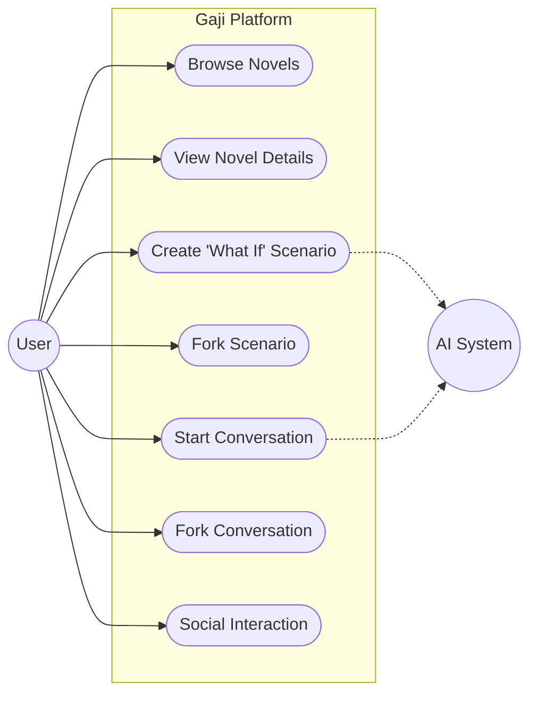

# System Use Cases

## Actors

### Primary Actors
1. **User (Reader / Creator)**
   - Authenticated user who explores novels, creates scenarios, and engages in conversations.
   - Can act as both a consumer (reading/chatting) and a creator (making scenarios).

### Secondary Actors
2. **AI System**
   - Provides character role-play responses.
   - Generates scenario templates and validations.
3. **Administrator**
   - Manages system configuration and content moderation.

## Use Case Diagram

## Detailed Use Cases

### 1. Novel Exploration
- **Actor**: User
- **Description**: Users browse available novels to find interesting stories to explore.
- **Flow**:
  1. User views list of novels (filterable by genre, popularity).
  2. User selects a novel to view details (characters, existing scenarios).

### 2. Create "What If" Scenario (Root)
- **Actor**: User
- **Description**: Create a new alternative timeline from a base novel.
- **Flow**:
  1. User selects a novel.
  2. User defines "What If" parameters (Character Changes, Event Alterations, Setting Modifications).
  3. System (AI) validates the scenario coherence.
  4. Scenario is saved as a **RootUserScenario**.

### 3. Fork Scenario (Leaf)
- **Actor**: User
- **Description**: Create a variation of an existing scenario.
- **Flow**:
  1. User views an existing scenario.
  2. User chooses to fork it to add further twists.
  3. New scenario is saved as **LeafUserScenario** linked to the parent.

### 4. Conversation
- **Actor**: User, AI System
- **Description**: Chat with characters within the context of a specific scenario.
- **Flow**:
  1. User selects a scenario and a character.
  2. User sends a message.
  3. AI System responds acting as the character, aware of the scenario's context.

### 5. Fork Conversation
- **Actor**: User
- **Description**: Branch a conversation at a specific point to explore a different dialogue path.
- **Flow**:
  1. User views a conversation history.
  2. User selects a fork point.
  3. System creates a new conversation linked to the original, copying previous context.
