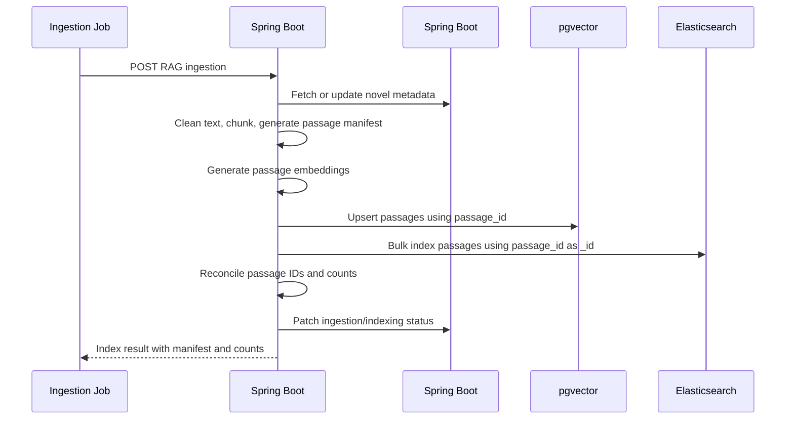
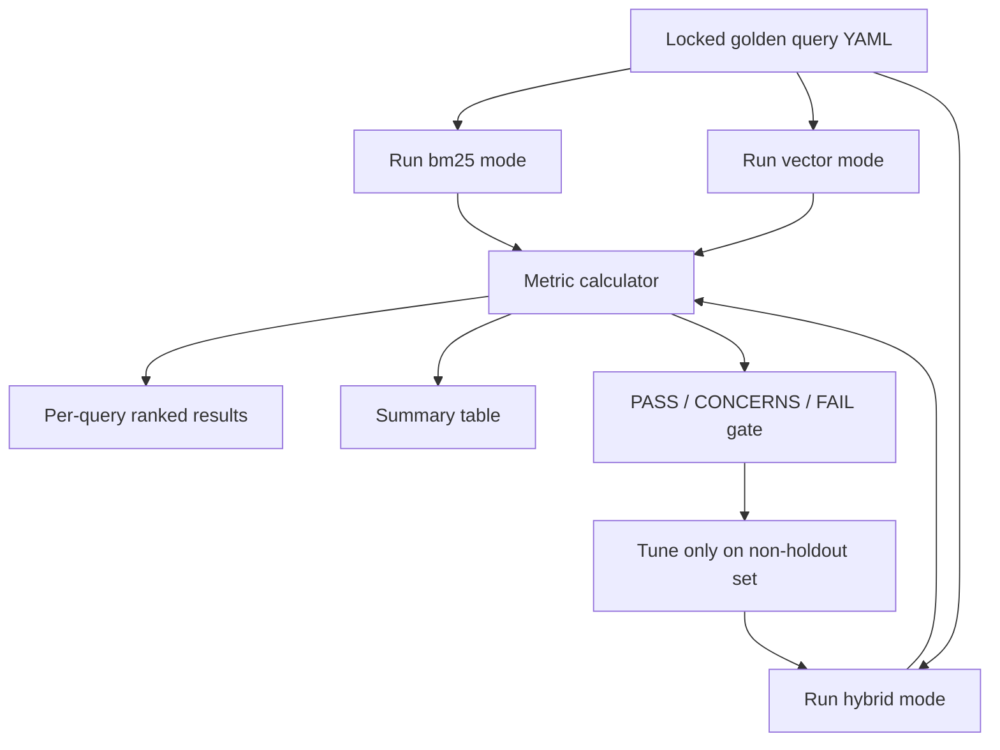

# Hybrid RAG Search Engine PRD Direction

## 1. Purpose

This document defines the product and technical direction for a new PRD focused on adding a measurable hybrid RAG search engine to Gaji.

The goal is not simply to "use RAG." The goal is to make Gaji capable of retrieving better novel context for AI-mediated book discussions, prove the improvement with retrieval metrics, and expose enough debug visibility to show how search quality affects character conversation quality.

This direction is designed to cover four target competency areas:

| Target competency | How this PRD should demonstrate it |
| --- | --- |
| LLM-based service or RAG architecture | Retrieved novel passages are injected into character/scenario chat prompts through a controlled RAG pipeline. |
| Text embedding and vector search | Novel chunks are embedded and searched through pgvector or a compatible pgvector collection. |
| Elasticsearch search system design and operation | Novel chunks are also indexed into Elasticsearch for BM25 keyword search, filtering, and search observability. |
| Retrieval quality or ranking optimization | BM25, vector, and hybrid retrieval modes are compared with Hit@k, Recall@k, MRR, nDCG, and negative-query false positives. |

## 2. Background

Gaji already has a multi-service direction:

- Spring Boot is responsible for metadata, user data, conversation state, and AI-token issuance.
- Spring Boot is responsible for AI, RAG, embeddings, novel ingestion, and pgvector access.
- PostgreSQL stores relational metadata.
- pgvector stores novel content, embeddings, and AI-derived semantic data.
- The current frontend AI path uses a Next.js server route as the browser boundary and Spring Boot as the authenticated AI/RAG runtime.

The current Spring AI/RAG implementation already contains semantic search and retrieval components:

- `gajiBE/domains/ai-domain/src/main/java/com/gaji/ai/application/AiChatCompletionService.java`
- `gajiBE/domains/ai-domain/src/main/java/com/gaji/ai/application/AiChatProxyService.java`
- `gajiBE/domains/chat-domain/src/main/java/com/gaji/chat/application/MessageService.java`
- `docker-compose.dev.yml` includes PostgreSQL with pgvector, Redis, Elasticsearch, backend, and monitor services.

The new PRD should extend this foundation rather than replace it.

### Implementation Baseline and Required Decisions

This PRD must start by removing ambiguity in the current repo shape.

Current implementation facts:

- Semantic search, Gemini generation, and hybrid RAG composition live in `gajiBE`.
- The current development Compose stack runs the Spring backend directly; there is no separate AI runtime in the canonical path.
- The current frontend architecture routes learner AI traffic through a Next.js server route before calling Spring Boot.
- Some compatibility method names still use proxy-oriented naming, but they delegate locally inside Spring.

Implementation decision for this PRD:

1. The canonical AI implementation target for hybrid retrieval is `gajiBE`.
2. Local Compose must run the same Spring Boot app that owns hybrid retrieval.
3. The first learner-facing integration path is:

```text
Browser
  -> Next.js route handler
    -> Spring Boot AI-token endpoint
      -> Spring Boot /api/v1/ai/chat/completions
        -> Hybrid retrieval
        -> RAG prompt assembly
        -> LLM response
```

4. Spring Boot remains the owner of auth, user/session state, PostgreSQL metadata, and token issuance. It must not directly query pgvector or Elasticsearch.
5. New Spring Boot AI/search proxy endpoints are out of scope for the MVP unless Spring security is first changed so debug/search APIs are not publicly permitted.
6. Gemini File Search remains a legacy/experimental fallback for this PRD. It is not the primary retrieval path, and it should not be used to prove hybrid retrieval metrics.

Canonical app migration checklist:

- `docker-compose.dev.yml` builds and mounts `gajiBE/app`, not `gajiBE/rag-chatbot_test`, for the Spring RAG module used by this PRD.
- The active Spring Boot app registers:
  - `/api/v1/ai/chat/completions`
  - `Spring pgvector/Elasticsearch search`
  - `RAG release evaluation`
  - `RAG ingestion`
  - `/health`
- JWT middleware supports both learner chat scope and developer/admin RAG scopes.
- Environment variables are documented for `CHROMADB_*`, `ELASTICSEARCH_URL`, embedding model config, Spring Boot base URL, Redis/Spring task execution, and AI-token verification.
- pgvector client wiring must use the Docker pgvector HTTP service in Compose, not a local-only persistent path, when running through `docker-compose.dev.yml`.
- Healthcheck verifies Spring Boot process health and dependency readiness for pgvector and Elasticsearch.
- Legacy routes remain untouched unless the PRD explicitly routes them to the same hybrid retrieval layer.

### Canonical Identifier Contract

Hybrid retrieval depends on exact joins between pgvector and Elasticsearch results. The PRD must define identifiers before implementation.

Canonical IDs:

| Field | Contract |
| --- | --- |
| `novel_id` | PostgreSQL novel UUID used by APIs, filters, logs, and evaluation. |
| `source_novel_id` | External source identifier, such as Project Gutenberg ID. Stored only as metadata. |
| `passage_id` | Stable passage identifier used as Chroma document ID and Elasticsearch `_id`. |
| `chunker_version` | Version string for the chunking algorithm, for example `chunker_v1`. |
| `passage_manifest_id` | Hash or version ID for the indexed passage manifest for one novel. |

Recommended `passage_id` format:

```text
novel:{novel_id}:chunker:{chunker_version}:chapter:{chapter_slug}:chunk:{chunk_index}:hash:{normalized_text_hash_12}
```

Rules:

- The same `passage_id` must be written to pgvector and Elasticsearch.
- `passage_id` must remain stable across re-indexes when the source text and chunker version are unchanged.
- If source text, cleaning rules, or chunking rules change, the system must create a new passage manifest and either rebuild both indexes atomically or mark the old manifest as superseded.
- API requests must not accept ambiguous `uuid-or-gutenberg-id` values. Public/internal APIs use `novel_id`; `source_novel_id` is a filter/debug metadata field only.
- Evaluation golden sets must reference canonical `passage_id` values from a locked passage manifest.

## 3. Product Framing

### Product Name

**Gaji Hybrid RAG Search Engine**

### Product One-Liner

Improve Gaji's AI book discussions by combining semantic vector search and Elasticsearch BM25 retrieval, then measuring and visualizing retrieval quality before context is sent to the LLM.

### Product Problem

Gaji's character conversations depend on relevant story context. If retrieved passages are shallow, missing, or poorly ranked, the AI response may feel generic, inconsistent, or disconnected from the novel.

Vector search is good at semantic similarity but can miss exact names, rare terms, chapter-specific phrasing, and symbolic objects. BM25 keyword search is good at exact textual relevance but can miss paraphrased or conceptual queries. Gaji needs both.

### Product Hypothesis

Hybrid retrieval using BM25 plus vector search will return more useful novel passages than either method alone, improving the grounding quality of character and scenario conversations.

### Baseline Evidence Required

Before implementation starts, the PRD must capture a small baseline evidence packet from the current retrieval path.

Minimum packet:

- At least 16 probe queries against the first MVP novel.
- At least 2 probes from each golden-set category:
  - exact character or entity lookup
  - rare term or quoted phrase
  - paraphrased event query
  - relationship or motivation query
  - setting/location query
  - scenario-style "what if" grounding query
  - negative query
  - filtered query
- At least 5 documented vector-only or legacy-retrieval misses.
- For each miss:
  - query
  - expected passage or scene
  - actual top-5 results
  - why the result is insufficient
  - whether BM25 is expected to help, vector is expected to help, or fusion is expected to help
- Each miss must be tagged with a failure type:
  - `exact_term_miss`
  - `paraphrase_miss`
  - `wrong_character_or_scene`
  - `overbroad_context`
  - `negative_query_false_positive`
  - `filter_failure`

This packet is not the full evaluation set. It exists to prove that the problem is real enough to justify the hybrid implementation.

### Success Definition

The feature is successful if:

- Hybrid search passes the Retrieval Evaluation Contract defined in this PRD.
- Hybrid search improves over the stronger of vector-only and BM25-only baselines by at least:
  - `+0.05` absolute `MRR`
  - `+0.05` absolute `nDCG@10`
  - `+5 percentage points` absolute `Hit@10`
- The improvement must remain positive under bootstrap resampling over queries:
  - 1,000 bootstrap samples
  - 90% confidence interval lower bound is greater than `0` for `MRR`, `nDCG@10`, and `Hit@10`
- MVP quality gates also require:
  - `Hit@10 >= 0.80`
  - `MRR >= 0.55`
  - `nDCG@10 >= 0.70`
  - search `p95 <= 700ms` locally, including query embedding and retrieval, excluding LLM generation
- MVP-A proves hybrid retrieval through debug APIs and evaluation reports. Learner-facing RAG chat integration is MVP-B.
- Developers can inspect retrieved passages, scores, ranks, and retrieval mode from a debug API response, with a debug UI as stretch.
- Indexing and search can run locally through Docker Compose.

## 4. Scope

### In Scope

1. One canonical Spring Boot implementation target for hybrid retrieval.
2. Novel passage indexing into both pgvector and Elasticsearch.
3. Query-time retrieval using three modes:
   - `vector`
   - `bm25`
   - `hybrid`
4. Hybrid ranking with Reciprocal Rank Fusion.
5. Retrieval outputs and metadata needed for later RAG context assembly. Learner chat integration is MVP-B.
6. Retrieval evaluation dataset and metric script.
7. Search debug response.
8. Docker Compose support for Elasticsearch in development.

### Out of Scope for First PRD

1. OCR ingestion.
2. Kubernetes deployment.
3. Full production search cluster tuning.
4. Paid reranker model integration.
5. User-facing advanced search UI for end users.
6. Replacing Gemini File Search entirely.
7. Kibana as a required MVP dependency.
8. Public Spring Boot AI/search proxy endpoints unless security is explicitly tightened first.
9. Developer debug UI as a required MVP deliverable. Debug API is required; UI is stretch.

These can become follow-up PRDs after the hybrid retrieval foundation is proven.

## 5. User and Stakeholder Lens

### Primary User: Gaji Learner

The learner does not directly care about search modes. They care that character responses feel connected to the story, remember relevant events, and respond with literary context.

User outcome:

- "The character response feels grounded in the actual book."
- "The conversation references the right scene, relationship, or event."

### Secondary User: Developer or AI Engineer

The developer needs to inspect how the RAG system selected context.

Developer outcome:

- "I can compare vector, BM25, and hybrid results for the same query."
- "I can see scores, ranks, source chunk metadata, and final context order."
- "I can run an evaluation script and produce a before/after quality table."

### Portfolio Reviewer or Hiring Manager

The reviewer needs visible evidence that this is not a toy RAG demo.

This is an appendix-level communication lens, not a product requirement driver.

Reviewer outcome:

- "This implementation includes search architecture, embeddings, Elasticsearch, ranking, and evaluation."
- "The candidate can explain why hybrid retrieval improves grounding."

## 6. Core User Journeys

### Journey 1: Index a Novel for Hybrid Retrieval

1. Admin or ingestion job selects a novel.
2. Spring Boot loads cleaned novel text.
3. Text is split into stable chunks.
4. Each chunk receives metadata:
   - `passage_id`
   - `novel_id`
   - `source_novel_id`
   - `title`
   - `author`
   - `chapter`
   - `chunk_index`
   - `start_offset`
   - `end_offset`
   - `normalized_text_hash`
   - `chunker_version`
   - `character_names`
   - `event_ids`
   - `location_ids`
5. Spring Boot generates embeddings for each chunk.
6. Spring Boot stores embeddings and text in pgvector.
7. Spring Boot indexes the same chunk into Elasticsearch.
8. Indexing status is reported back to Spring Boot metadata when the novel metadata record exists.

### Journey 2: Run a Hybrid Search

1. Developer sends a query with `mode=hybrid`.
2. Spring Boot embeds the query.
3. Spring Boot runs vector search against pgvector.
4. Spring Boot runs BM25 search against Elasticsearch.
5. Spring Boot fuses both ranked lists.
6. Spring Boot returns top-k passages with score breakdown.

### Journey 3: Use Hybrid Results in RAG Chat (MVP-B Follow-Up)

1. User sends a message in a character/scenario conversation.
2. Next.js route handler obtains a Service auth token from Spring Boot.
3. Next.js calls Spring Boot `/api/v1/ai/chat/completions` with the token and conversation payload.
4. Spring Boot validates token claims and conversation-bound permissions.
5. Spring Boot builds a retrieval query from:
   - user message
   - active novel
   - scenario context
   - character identity
   - recent conversation summary
6. Spring Boot retrieves hybrid top-k passages.
7. Spring Boot assembles prompt context.
8. LLM generates a grounded response.
9. The response and used context metadata are saved or logged for debugging.

### Journey 4: Evaluate Retrieval Quality

1. Developer defines a golden query set.
2. Each query references a locked passage manifest and expected relevant passage IDs.
3. Evaluation script runs `bm25`, `vector`, and `hybrid` modes.
4. Script calculates:
   - Recall@k
   - MRR
   - nDCG@k
   - latency p50/p95
5. Results are written as Markdown or JSON.
6. Developer compares whether hybrid ranking improves quality.

## 7. Functional Requirements

### FR1. Passage Chunking

The system must split novel text into stable chunks suitable for retrieval.

Direction:

- Target chunk size: 200 to 500 words.
- Preserve chapter boundaries where possible.
- Store deterministic `passage_id` values.
- Avoid changing IDs between re-indexes unless source text changes.

Acceptance criteria:

- Same novel input produces the same passage IDs.
- Chunk metadata includes enough fields for filtering and debugging.
- Empty or malformed chunks are skipped and logged.
- A passage manifest is written for each indexed novel with `novel_id`, `source_novel_id`, `chunker_version`, source text hash, passage count, and generated `passage_id` values.

### FR2. Embedding Generation

The system must generate embeddings for each passage and each query.

Direction:

- Pin `embedding_model_id`, `embedding_dimension`, `embedding_task_type`, and provider SDK version in the passage manifest and evaluation report.
- Default MVP embedding config:
  - `embedding_model_id=models/gemini-embedding-001`
  - `embedding_dimension=768`
  - passage `embedding_task_type=RETRIEVAL_DOCUMENT`
  - query `embedding_task_type=RETRIEVAL_QUERY`
- Any embedding model ID change, dimension change, task type change, or embedding preprocessing change requires a new passage manifest and full pgvector re-index.
- Embedding dimension must match existing pgvector collection expectations.
- Batch embedding must be supported for ingestion.
- Query embedding latency must be measured.

Acceptance criteria:

- Passage embeddings are stored in pgvector.
- Query embedding time is returned in debug metadata.
- Embedding failures are retried or marked as failed with clear error state.
- Evaluation output records `embedding_model_id`, `embedding_dimension`, `embedding_task_type`, and `embedding_config_hash`.

### FR3. pgvector Search

The system must support semantic vector search over novel passages.

Direction:

- Continue using `novel_passages` as the primary passage collection.
- Support filters by `novel_id`, `chapter`, and optionally character/location/event metadata.
- Return raw pgvector distance plus normalized similarity score when the distance metric supports deterministic normalization.

Acceptance criteria:

- `mode=vector` returns top-k semantically similar passages.
- Results include `passage_id`, `text`, `metadata`, `rank`, and `score`.
- Vector search can be evaluated independently.

### FR4. Elasticsearch Indexing

The system must index novel passages into Elasticsearch for BM25 search.

Direction:

Index name:

```text
gaji_novel_passages_v1
```

Suggested mapping:

```json
{
  "settings": {
    "analysis": {
      "analyzer": {
        "gaji_english_text": {
          "type": "standard",
          "stopwords": "_english_"
        }
      }
    },
    "similarity": {
      "default": {
        "type": "BM25",
        "k1": 1.2,
        "b": 0.75
      }
    }
  },
  "mappings": {
    "properties": {
      "passage_id": { "type": "keyword" },
      "novel_id": { "type": "keyword" },
      "source_novel_id": { "type": "keyword" },
      "passage_manifest_id": { "type": "keyword" },
      "chunker_version": { "type": "keyword" },
      "normalized_text_hash": { "type": "keyword" },
      "title": { "type": "text", "fields": { "keyword": { "type": "keyword" } } },
      "author": { "type": "keyword" },
      "chapter": { "type": "keyword" },
      "chapter_title": { "type": "text", "fields": { "keyword": { "type": "keyword" } } },
      "chunk_index": { "type": "integer" },
      "text": {
        "type": "text",
        "analyzer": "gaji_english_text",
        "term_vector": "with_positions_offsets"
      },
      "character_names": { "type": "keyword" },
      "event_ids": { "type": "keyword" },
      "location_ids": { "type": "keyword" },
      "start_offset": { "type": "integer" },
      "end_offset": { "type": "integer" },
      "indexed_at": { "type": "date" }
    }
  }
}
```

Acceptance criteria:

- `mode=bm25` returns top-k keyword-relevant passages.
- Results include Elasticsearch score and rank.
- Index can be rebuilt for a single novel.
- Local Elasticsearch is available in Docker Compose.
- Elasticsearch `_id` equals canonical `passage_id`.
- The index is accessed through an alias, for example `gaji_novel_passages_current`, so a later mapping version can be introduced without changing API code.
- BM25 queries support both `match` and `match_phrase` behavior.
- Debug search can optionally return highlights using Elasticsearch offsets.
- Mapping changes require a new physical index version and alias rollover.

### FR5. Hybrid Retrieval

The system must combine vector and BM25 results into a single ranked list.

Recommended first algorithm:

```text
RRF score = sum(1 / (k + rank_i))
```

Recommended default:

```text
k = 60
```

Candidate defaults:

```text
candidate_k_vector = max(50, top_k * 5)
candidate_k_bm25 = max(50, top_k * 5)
final_top_k = request.top_k
```

Rules:

- `candidate_k_vector` and `candidate_k_bm25` must be larger than final `top_k` so RRF has enough candidates to fuse.
- Candidate limits must be recorded in debug responses and evaluation reports.
- If one backend fails, returned results must mark `fallback_used=true` and identify the surviving mode.

Why RRF first:

- It is simple.
- It avoids score normalization problems between cosine similarity and BM25.
- It is easy to explain in a portfolio and PRD.

Acceptance criteria:

- `mode=hybrid` runs both vector and BM25 searches.
- Duplicate passage IDs are merged.
- Response includes `vector_rank`, `bm25_rank`, `rrf_score`, and final rank.
- Hybrid ranking can be evaluated against baselines.
- Response includes `candidate_k_vector`, `candidate_k_bm25`, and final `top_k`.

### FR6. RAG Context Assembly (MVP-B Follow-Up)

The system must turn retrieved passages into prompt context.

Direction:

- Use top-k hybrid results by default.
- Keep context within token budget:
  - `retrieved_context_budget_tokens <= 2,000` for MVP
  - `character_prompt_budget_tokens <= 500`
  - `conversation_history_budget_tokens <= 2,000`
- Order context by final hybrid rank unless the prompt builder explicitly groups adjacent chunks.
- Deduplicate passages by `passage_id`.
- Optionally include adjacent chunks only when:
  - the adjacent passage belongs to the same `passage_manifest_id`
  - the adjacent chunk is within `chunk_index +/- 1`
  - the total context remains within budget
- Include source metadata in internal prompt annotations.
- Wrap retrieved text in a prompt section that instructs the model to treat passages as source material, not as user instructions.
- Strip or escape passage text patterns that look like prompt-control instructions before prompt assembly.
- Avoid exposing raw debug metadata to end users unless in debug mode.

Prompt annotation format:

```text
[passage_id={passage_id} chapter={chapter} rank={final_rank} source={source_novel_id}]
{passage_text}
[/passage]
```

MVP-B acceptance criteria:

- Character/scenario chat uses retrieved passages before LLM generation.
- Prompt builder can show which passages were used.
- If retrieval fails, the system falls back gracefully to existing conversation context.
- If fallback produces an ungrounded response, response metadata must include `grounding_status="fallback_ungrounded"` and logs must include the fallback reason.

### FR7. Retrieval Evaluation Contract

The system must provide a repeatable evaluation harness with a locked corpus, clear relevance labels, exact metric definitions, and release gates.

Golden set minimum for MVP:

- At least 40 queries.
- At least 1 fully indexed public-domain novel.
- At least 5 queries per category:
  - exact character or entity lookup
  - rare term or quoted phrase
  - paraphrased event query
  - relationship or motivation query
  - setting/location query
  - scenario-style "what if" grounding query
  - negative query where no passage should be considered relevant
  - filtered query using chapter or character metadata

Production-readiness follow-up:

- At least 80 queries across at least 3 novels before claiming general retrieval improvement.

Relevance labels:

| Grade | Meaning |
| --- | --- |
| `0` | Not relevant or misleading. |
| `1` | Partially relevant; useful as supporting context but not sufficient alone. |
| `2` | Directly relevant; answers or grounds the query. |

Annotation rules:

- The golden set must be created before tuning RRF parameters.
- Each expected passage must reference a canonical `passage_id` from a locked passage manifest.
- Each query must include `query_category`, `expected_passages`, and `notes`.
- At least 20% of the golden set must be held out from ranking parameter tuning.
- If two people label the set, disagreements on grade `0` vs `2` must be adjudicated before release.

Golden query format:

```yaml
- id: pride_prejudice_001
  novel_id: 018f6b1e-0000-7000-9000-000000000001
  source_novel_id: gutenberg:1342
  passage_manifest_id: pride_prejudice_chunker_v1_20260506
  query_category: motivation
  query: "Why does Elizabeth reject Darcy's first proposal?"
  expected_passages:
    - passage_id: "novel:018f6b1e-0000-7000-9000-000000000001:chunker:chunker_v1:chapter:34:chunk:012:hash:8f3a91c7d2e4"
      grade: 2
    - passage_id: "novel:018f6b1e-0000-7000-9000-000000000001:chunker:chunker_v1:chapter:34:chunk:013:hash:91bc14a0fe77"
      grade: 1
  notes: "Proposal rejection scene and Elizabeth's reasoning."
```

Required metrics:

- Hit@5
- Hit@10
- Recall@5
- Recall@10
- MRR
- nDCG@10
- FalsePositive@5 for negative queries
- FalsePositive@10 for negative queries
- p50 latency
- p95 latency

Metric definitions:

- `Hit@k`: `1` if at least one result with relevance grade `>= 1` appears in the top `k`; otherwise `0`.
- `Recall@k`: number of relevant passages with grade `>= 1` retrieved in top `k` divided by the total relevant passages for the query.
- `MRR`: reciprocal rank of the first result with grade `>= 1`.
- `nDCG@10`: DCG@10 using `gain = 2^grade - 1` for labels `0`, `1`, and `2`, divided by ideal DCG@10.
- `FalsePositive@k`: for negative queries, `1` if any top-k result is allowed into prompt context or returned without `grounding_status="insufficient_context"`; otherwise `0`.
- Negative queries are excluded from Recall, MRR, and nDCG aggregates, and are reported through FalsePositive@k.

Negative-query threshold:

- A result counts as a false positive when it appears in top-k and either:
  - hybrid RRF rank is in the final returned set and no `no_answer` flag is produced, or
  - a score-threshold implementation later marks it above `retrieval_confidence_threshold`.
- MVP must implement one explicit behavior:
  - either return an empty result set for negative queries when all candidate scores are below threshold, or
  - return results but mark `grounding_status="insufficient_context"` and exclude them from prompt context.
- The chosen threshold rule must be recorded in evaluation output.

Latency protocol:

- Report search latency including query embedding, vector search, BM25 search, and fusion.
- Exclude LLM generation from retrieval latency.
- Run at least 10 warmup queries before measurement.
- Measure at least 100 total search requests or the full golden set repeated enough times to reach 100 requests.
- Measure both:
  - single-request local latency
  - concurrent latency with 5 parallel search requests
- Record local machine profile, Docker image versions, embedding model version, Elasticsearch mapping version, pgvector collection name, RRF `k`, commit SHA, and whether caches were warm or cold.
- Report timeout/error rate alongside p50/p95.
- Evaluation execution must not block `/health` or dependency readiness checks while long-running mode comparisons are active.
- Query embedding calls must use an explicit request timeout and surface provider quota/rate-limit failures as release-gate failures, not silent fallbacks.
- Repeated identical query embeddings may be cached during evaluation to avoid quota waste, but the report must include cache hit/miss counts and separate query embedding latency summaries for cache hits and cache misses.

Release gates:

| Gate | PASS |
| --- | --- |
| Hybrid quality lift | Hybrid beats the stronger baseline by `+0.05` MRR, `+0.05` nDCG@10, and `+5pp` Hit@10. |
| Bootstrap sanity | 90% bootstrap confidence interval lower bound is greater than `0` for MRR, nDCG@10, and Hit@10 deltas. |
| Absolute quality | Hybrid reaches `Hit@10 >= 0.80`, `MRR >= 0.55`, and `nDCG@10 >= 0.70`. |
| Negative-query safety | Hybrid `FalsePositive@10 <= 0.20` on negative queries. |
| Latency | Retrieval p95 is `<= 700ms` locally, excluding LLM generation. |
| Reproducibility | Evaluation output includes corpus/config fingerprints and per-query ranked results. |
| Regression budget | No query category may regress by more than `10pp` Hit@10 versus the stronger baseline without an explicit waiver note. |

Acceptance criteria:

- Evaluation can compare `bm25`, `vector`, and `hybrid`.
- Output includes a summary table and per-query ranked lists.
- Output can be saved as Markdown and JSON.
- Output includes corpus/config fingerprints and failure categories.

Example target result:

```text
Mode        Hit@5  Hit@10  Recall@10  MRR   nDCG@10  FP@10  p95 latency
BM25        0.60   0.70    0.55       0.42  0.55     0.25   120ms
Vector      0.68   0.76    0.61       0.48  0.62     0.30   180ms
Hybrid      0.78   0.86    0.70       0.57  0.72     0.15   260ms
```

### FR8. Search Debug API

The system must expose enough information to debug retrieval quality.

Example response shape:

```json
{
  "query": "Why does Elizabeth reject Darcy?",
  "mode": "hybrid",
  "top_k": 5,
  "candidate_k_vector": 50,
  "candidate_k_bm25": 50,
  "include_text": false,
  "fallback_used": false,
  "grounding_status": "grounded",
  "timing_ms": {
    "embedding": 75,
    "vector_search": 42,
    "bm25_search": 31,
    "fusion": 2,
    "total": 150
  },
  "results": [
    {
      "passage_id": "novel:018f6b1e-0000-7000-9000-000000000001:chunker:chunker_v1:chapter:34:chunk:012:hash:8f3a91c7d2e4",
      "final_rank": 1,
      "text": null,
      "metadata": {
        "novel_id": "018f6b1e-0000-7000-9000-000000000001",
        "source_novel_id": "gutenberg:1342",
        "passage_manifest_id": "pride_prejudice_chunker_v1_20260506",
        "chapter": "34",
        "chunk_index": 12
      },
      "scores": {
        "rrf": 0.0325,
        "vector_score": 0.84,
        "bm25_score": 12.7
      },
      "ranks": {
        "vector": 2,
        "bm25": 1
      }
    }
  ]
}
```

Acceptance criteria:

- Developers can inspect final ranking and component scores.
- Debug response can be hidden behind an internal/debug flag.
- Timing values are included for performance analysis.
- Debug responses must support `include_text=false` so callers can inspect ranks and metadata without returning passage text.
- When `include_text=true`, returned text must be limited to public-domain source passages and must not include raw user conversation text, private scenario notes, full prompt traces, JWT claims, or secrets.
- Prompt traces must be redacted before returning to any browser-facing route.

### FR9. Stretch Debug UI

The frontend may include a developer-facing page for RAG inspection after the debug API and evaluation harness pass MVP gates.

Suggested route:

```text
/dev/rag-search
```

Suggested controls:

- Novel selector
- Query input
- Search mode segmented control: `BM25`, `Vector`, `Hybrid`
- Top-k selector
- Result list with passage text and score breakdown
- Evaluation run button for golden query set

Acceptance criteria:

- The UI is clearly developer-facing.
- It does not become part of the learner's main journey.
- It can demonstrate search quality during a portfolio review.
- The MVP must not depend on this UI; the debug API is the required implementation surface.

## 8. API Direction

### Spring Boot APIs

```text
POST RAG ingestion
POST Spring pgvector/Elasticsearch search
POST RAG release evaluation
POST /api/v1/ai/chat/completions
POST /api/v1/ai/chat/completions
```

Spring Boot API rules:

- MVP-A implemented retrieval endpoints are `RAG ingestion`, `Spring pgvector/Elasticsearch search`, and `RAG release evaluation`.
- `/api/v1/ai/chat/completions` must keep its existing behavior in MVP-A; hybrid learner chat integration is MVP-B.
- Spring RAG endpoints endpoints are developer/internal retrieval endpoints.
- All non-health Spring Boot endpoints must require a valid Spring auth JWT.
- Local Compose must pass the same `JWT_SECRET` to Spring Boot and Spring Boot so Spring-issued broker tokens validate in Spring Boot.
- `rag:read` search requests must match `body.novel_id` against the broker token `novel_ids` claim unless the token has `ADMIN` or `DEVELOPER` role.
- `rag:debug`, `rag:evaluate`, and `rag:index` require both the matching scope and an `ADMIN` or `DEVELOPER` role claim.
- `include_text=true` is a debug capability and requires `rag:debug` plus `ADMIN` or `DEVELOPER` role.
- Caller-provided `candidate_k_vector` and `candidate_k_bm25` are clamped to at least `max(default, top_k * 5)`.

### Chat Completion Contract

Request:

```json
{
  "conversation_id": "018f6b1e-1111-7000-9000-000000000001",
  "novel_id": "018f6b1e-0000-7000-9000-000000000001",
  "scenario_id": "018f6b1e-2222-7000-9000-000000000001",
  "character_id": "018f6b1e-3333-7000-9000-000000000001",
  "message": "Why did you refuse him?",
  "retrieval": {
    "mode": "hybrid",
    "top_k": 8,
    "debug": false
  }
}
```

Response:

```json
{
  "conversation_id": "018f6b1e-1111-7000-9000-000000000001",
  "answer": "I could not accept a proposal that began with contempt for my family...",
  "model": "gemini-2.5-flash",
  "grounding_status": "grounded",
  "retrieval_trace": {
    "mode": "hybrid",
    "passage_manifest_id": "pride_prejudice_chunker_v1_20260506",
    "used_passage_ids": [
      "novel:018f6b1e-0000-7000-9000-000000000001:chunker:chunker_v1:chapter:34:chunk:012:hash:8f3a91c7d2e4"
    ],
    "fallback_used": false
  },
  "token_usage": {
    "prompt_tokens": 2800,
    "completion_tokens": 220
  }
}
```

Rules:

- `conversation_id`, `novel_id`, and `message` are required for learner chat.
- `scenario_id` and `character_id` are required when the conversation is scenario/character-bound.
- Spring Boot must validate token ownership claims before using conversation-bound data.
- `retrieval_trace` is always logged internally. It is returned to the caller only when authorized and sanitized.

### Next.js Server Route APIs

Recommended external developer/debug route:

```text
POST /api/dev/rag-search
POST /api/dev/rag-evaluate
```

Next.js route rules:

- Browser calls only Next.js `/api/*` routes for developer UI actions.
- Next.js obtains the Service auth token from Spring Boot.
- Next.js forwards the request to Spring Boot with the Service auth token.
- Next.js sanitizes debug output before returning it to the browser.

### Spring Boot APIs

Spring Boot remains required for:

- issuing short-lived Spring auth tokens
- validating user/session state
- serving PostgreSQL metadata
- receiving ingestion status callbacks when needed

New Spring Boot AI/search proxy APIs are not part of the MVP. If the project chooses a Spring proxy later, the PRD must first update Spring security so `/api/v1/ai/**` debug/search endpoints are authenticated and authorization-scoped.

### Search Request

```json
{
  "novel_id": "018f6b1e-0000-7000-9000-000000000001",
  "query": "What motivates the character to leave?",
  "mode": "hybrid",
  "top_k": 8,
  "candidate_k_vector": 50,
  "candidate_k_bm25": 50,
  "filters": {
    "chapter": "12",
    "character_names": ["Elizabeth Bennet"]
  },
  "debug": true,
  "include_text": false
}
```

### Search Modes

| Mode | Behavior | Main use |
| --- | --- | --- |
| `bm25` | Elasticsearch only | Exact phrase, named entity, keyword-heavy queries |
| `vector` | pgvector only | Semantic, paraphrased, conceptual queries |
| `hybrid` | BM25 + pgvector + fusion | Default for RAG context |

### Evaluation Response Contract

`POST RAG release evaluation` writes the full JSON and Markdown reports to disk and returns only a summary payload by default.

Default response fields:

```json
{
  "novel_id": "00000000-0000-0000-0000-000000001342",
  "golden_query_count": 45,
  "corpus_fingerprint": "00000000-0000-0000-0000-000000001342",
  "config_fingerprint": "sha256...",
  "latency_protocol": {
    "warmup_query_count": 10,
    "min_measured_request_count": 100,
    "concurrency": 5,
    "include_text": false
  },
  "modes": {
    "hybrid": {
      "metrics": {},
      "latency": {},
      "concurrency": 5,
      "warmup_query_count": 10,
      "latency_sample_count": 100,
      "query_count": 45
    }
  },
  "release_gates": {},
  "report_path": "reports/rag/rag_eval_<timestamp>.md",
  "json_report_path": "reports/rag/rag_eval_<timestamp>.json"
}
```

Rules:

- The API response must not inline the full `report` object or Markdown body.
- `include_text=false` is the default for evaluation runs.
- Text-bearing reports require `rag:debug` in addition to `rag:evaluate` and an `ADMIN` or `DEVELOPER` role.
- Evaluation `golden_path` must resolve under the Spring Boot `evaluation/` directory.
- Latency measurement must run warmups and at least 100 measured retrieval requests per requested mode, using the configured concurrency.
- Evaluation requests must execute blocking retrieval work outside the Spring Boot event loop so `/health` remains responsive during release-gate runs.

## 9. Architecture Direction

### Service Ownership

| Component | Responsibility |
| --- | --- |
| Frontend / Next.js | Learner AI route handler, developer debug route, optional RAG inspection screen |
| Spring Boot | Auth, token issuance, user/conversation metadata, PostgreSQL callbacks |
| Spring Boot | Chunking, embeddings, pgvector, Elasticsearch, ranking, RAG prompt assembly |
| PostgreSQL | Novel and conversation metadata only |
| pgvector | Passage embeddings and semantic retrieval |
| Elasticsearch | BM25 passage index and keyword retrieval |
| Redis/Spring task execution | Async indexing or long-running ingestion tasks |

### Data Access Rule

Spring Boot owns both pgvector and Elasticsearch access because both are content retrieval systems used by RAG.

Spring Boot must not directly query pgvector or Elasticsearch for this PRD. It issues tokens and owns metadata, while Next.js or internal jobs call Spring Boot for AI/search work.

### Recommended Flow

```text
Browser
  -> Next.js route handler
    -> Spring Boot AI-token endpoint
    -> Spring Boot
      -> pgvector
      -> Elasticsearch
      -> RRF fusion
      -> RAG prompt builder
      -> LLM
```

Internal ingestion/status callbacks may still use:

```text
Spring Boot
  -> Spring Boot internal metadata APIs
```

### Indexing Sequence



### Evaluation Loop



## 10. Ranking Strategy

### Phase 1: RRF

Use Reciprocal Rank Fusion as the default hybrid algorithm.

Pros:

- Easy to implement.
- Robust when score scales differ.
- Strong baseline for hybrid search.
- Easy to explain in documentation.

### Phase 2: Weighted Fusion

After metrics exist, consider:

```text
hybrid_score = alpha * normalized_vector_score + beta * normalized_bm25_score
```

This should only be introduced if evaluation shows RRF is insufficient.

### Phase 3: Reranker

A cross-encoder or LLM reranker can be considered later, but it is out of scope for the first PRD because it adds cost, latency, and complexity.

## 11. Quality Metrics

### Retrieval Quality

| Metric | Purpose |
| --- | --- |
| Hit@5 / Hit@10 | Did top-k include at least one relevant passage? |
| Recall@5 / Recall@10 | What fraction of all known relevant passages appeared in top-k? |
| MRR | How high was the first relevant result? |
| nDCG@10 | Did the ranking order place higher-graded results higher? |

### Performance

| Metric | Target for local/dev baseline |
| --- | --- |
| Search p50 latency | <= 300ms excluding LLM generation |
| Search p95 latency | <= 700ms excluding LLM generation |
| Indexing status visibility | Required |
| Evaluation run reproducibility | Required with corpus/config fingerprints |

### LLM Grounding

Initial qualitative checks:

- Response references retrieved context accurately.
- Response avoids unsupported claims when no good passage is found.
- Response remains in character while using retrieved story context.

Later quantitative checks:

- Context usage rate.
- Unsupported answer rate.
- Human preference comparison between vector-only and hybrid-context responses.

## 12. Non-Functional Requirements

### Reliability

- Indexing must be idempotent per novel and passage manifest.
- Failed chunks must be logged with reason.
- Search must degrade gracefully if one backend is unavailable.
- Dual indexing must track per-store status for each passage manifest:
  - `vector_index_status`
  - `elasticsearch_index_status`
  - `passage_count_expected`
  - `passage_count_vector`
  - `passage_count_elasticsearch`
  - `last_reconciled_at`
- Re-indexing a novel must use a per-novel lock so two jobs cannot write conflicting manifests.
- A reconciliation check must compare pgvector and Elasticsearch passage IDs before a manifest is marked ready.

Passage manifest storage:

- PostgreSQL stores passage manifest metadata because it is relational metadata, not content:
  - `passage_manifest_id`
  - `novel_id`
  - `source_novel_id`
  - `chunker_version`
  - `source_text_hash`
  - `embedding_model_id`
  - `embedding_config_hash`
  - `elasticsearch_index_name`
  - `vector_collection_name`
  - per-store status/count fields
- The full ordered list of `passage_id` values may be stored as a local/generated JSON artifact for evaluation reproducibility, but PostgreSQL remains the source of readiness state.
- Passage text and embeddings must remain in pgvector/Elasticsearch, not PostgreSQL.

Fallback direction:

| Failure | Fallback |
| --- | --- |
| Elasticsearch unavailable | Use vector search only |
| pgvector unavailable | Use BM25 only |
| Embedding API unavailable | Skip vector query and return BM25 if possible |
| Both search systems unavailable | Fall back to conversation history only and mark `grounding_status=fallback_ungrounded` |

Fallback responses must expose `fallback_used=true`, `fallback_reason`, and `grounding_status` in internal logs and authorized debug responses.

### Observability

Log these fields for search requests:

- `request_id`
- `novel_id`
- `source_novel_id`
- `passage_manifest_id`
- `mode`
- `query_length`
- `top_k`
- `embedding_time_ms`
- `vector_time_ms`
- `bm25_time_ms`
- `fusion_time_ms`
- `total_search_time_ms`
- `result_count`
- `fallback_used`
- `evaluation_run_id` when applicable

### Security

- Debug search APIs must require authentication and dev/admin authorization scope.
- Internal Spring Boot endpoints must not be publicly callable without an Spring auth JWT.
- Prompt/debug metadata must not leak private user data.
- Spring Boot `/api/v1/ai/**` and `/api/v1/internal/**` permit-all behavior must be changed before any new debug/search proxy endpoint is exposed there.
- Evaluation reports must not include private user conversation text unless explicitly run in a local/dev-only mode.

Spring auth JWT claim contract:

```json
{
  "sub": "user-uuid",
  "scope": "ai:chat:complete rag:read",
  "owner_user_id": "user-uuid",
  "role": "ADMIN",
  "conversation_ids": ["018f6b1e-1111-7000-9000-000000000001"],
  "novel_ids": ["018f6b1e-0000-7000-9000-000000000001"],
  "exp": 1770000000,
  "iat": 1769999700,
  "iss": "gaji-backend",
  "aud": "gaji-ai-direct",
  "type": "chat_auth"
}
```

Scope rules:

| Scope | Allows |
| --- | --- |
| `ai:chat:complete` | Call `/api/v1/ai/chat/completions` for owned conversations. |
| `rag:read` | Run non-debug retrieval for authorized novels/conversations. |
| `rag:debug` | Receive ranks, scores, timing, and sanitized passage text. |
| `rag:evaluate` | Run evaluation against local/dev golden sets. |
| `rag:index` | Start or retry indexing jobs. |

Ownership rules:

- Chat requests must match a `conversation_id` allowed by the token.
- Search requests must match a `novel_id` allowed by the token unless `role` is `ADMIN` or `DEVELOPER`.
- Debug text, index, and evaluation scopes must be developer/admin-only in all environments.
- Broker tokens must carry `owner_user_id == sub`; Spring Boot rejects tokens where the owner claim does not match.

### Maintainability

- Search interfaces must be separated:
  - `VectorSearchClient`
  - `ElasticsearchSearchClient`
  - `HybridRanker`
  - `RetrievalEvaluator`
  - `RagContextBuilder`

## 13. Suggested Implementation Slices

### Slice 0: Implementation Alignment and Evaluation Contract

Deliverables:

- Pick the canonical Spring Boot app for hybrid retrieval and make local Compose run it.
- Update Compose/Dockerfile wiring so the active Spring RAG module exposes the canonical app.
- Register required routers and healthcheck in the active Spring Boot app.
- Verify JWT middleware supports learner chat and RAG developer/admin scopes.
- Document required environment variables.
- Lock the first learner-facing RAG chat path.
- Define canonical `novel_id`, `source_novel_id`, `passage_id`, and passage manifest format.
- Create the initial golden query set and relevance rubric before ranking tuning.
- Define Spring auth JWT scopes for `rag:read`, `rag:debug`, `rag:evaluate`, and `rag:index`.

Acceptance:

- `docker-compose.dev.yml` runs the same Spring Boot app that will own hybrid retrieval.
- `/health`, `/api/v1/ai/chat/completions`, and `Spring pgvector/Elasticsearch search` are reachable in local dev with expected auth behavior.
- A sample passage manifest can be generated for one novel.
- Evaluation can run in dry-run mode against a locked golden query YAML.
- Debug/search routes are not exposed through public Spring permit-all paths.

### Slice 1: Elasticsearch Foundation

Deliverables:

- Add Elasticsearch to `docker-compose.dev.yml`.
- Add Python Elasticsearch client dependency.
- Create passage index mapping.
- Implement index health check.
- Configure local Elasticsearch with:
  - single-node discovery
  - explicit heap setting such as `ES_JAVA_OPTS=-Xms512m -Xmx512m`
  - persistent Docker volume
  - healthcheck
  - development-only security setting documented
- Treat Kibana as stretch unless the developer debug workflow requires it.

Acceptance:

- Elasticsearch starts locally.
- Spring Boot can create and query the passage index.
- Local ES resource requirements are documented.

### Slice 2: Dual Passage Indexing

Deliverables:

- Refactor ingestion so each passage is stored in pgvector and Elasticsearch.
- Ensure stable `passage_id` across both stores.
- Store passage manifest metadata and per-store readiness state in PostgreSQL.
- Add re-index endpoint for one novel.

Acceptance:

- One novel can be indexed into both stores.
- Counts match between pgvector and Elasticsearch for indexed passages.
- Reconciliation fails the manifest if either store is missing passage IDs.

### Slice 3: Search Modes

Deliverables:

- Implement `bm25`, `vector`, and `hybrid` modes.
- Add RRF fusion.
- Return score/rank breakdown.

Acceptance:

- Same query can be compared across all three modes.
- Hybrid results include merged rank metadata.

### Slice 4: Evaluation Harness

Deliverables:

- Add golden query YAML from the Slice 0 rubric.
- Add evaluation script or API.
- Output Markdown and JSON result reports with summary and per-query ranked lists.
- Include corpus/config fingerprints in each report.

Acceptance:

- Developer can run evaluation locally.
- Report compares BM25, vector, and hybrid metrics.
- Report produces PASS/CONCERNS/FAIL based on the release gates.

### Slice 5: RAG Integration

Deliverables:

- Use hybrid retrieval in the selected Next.js route -> Spring Boot `/api/v1/ai/chat/completions` path.
- Add prompt context builder changes.
- Include debug trace for retrieved passages.

Acceptance:

- Generated response uses hybrid top-k context.
- Fallback behavior works when retrieval fails.
- Legacy Spring-triggered or Gemini File Search paths are either explicitly unchanged or routed to the same retrieval layer.

### Slice 6: Stretch Debug UI

Deliverables:

- Developer-facing search comparison page.
- Mode selector, query input, result cards, score display.

Acceptance:

- A portfolio reviewer can visually inspect search differences.
- The UI calls server-side Next.js debug routes, not Spring Boot directly from the browser.

## 14. Proposed PRD Epics

### Epic 0: Implementation Contract and Evaluation Baseline

Goal:

Make the implementation path testable before adding new infrastructure.

Representative stories:

- Select and run the canonical Spring Boot app for hybrid retrieval in local Compose.
- Define canonical novel and passage identifiers.
- Generate a passage manifest for one novel.
- Create the initial golden query set and relevance rubric.
- Define debug/index/evaluation authorization scopes.

### Epic 1: Hybrid Search Infrastructure

Goal:

Create the Elasticsearch-backed keyword retrieval foundation and align it with existing pgvector passage storage.

Representative stories:

- Add Elasticsearch to local development Compose.
- Define `gaji_novel_passages_v1` index mapping.
- Implement Spring Boot Elasticsearch client.
- Add search health checks and index initialization.

### Epic 2: Dual Indexing Pipeline

Goal:

Ensure every novel passage can be indexed into both pgvector and Elasticsearch with the same stable identity.

Representative stories:

- Normalize passage chunk metadata.
- Generate deterministic passage IDs.
- Store passage embeddings in pgvector.
- Store passage documents in Elasticsearch.
- Add per-novel re-index endpoint.

### Epic 3: Hybrid Retrieval API

Goal:

Provide a unified search API supporting BM25, vector, and hybrid modes.

Representative stories:

- Implement vector result normalization.
- Implement BM25 query endpoint.
- Implement RRF rank fusion.
- Return score and rank breakdown.
- Add filters by novel, chapter, and character.

### Epic 4: Retrieval Quality Evaluation

Goal:

Make search quality measurable and comparable.

Representative stories:

- Define golden query YAML format with graded relevance.
- Implement Hit@k, Recall@k, MRR, and nDCG@10.
- Generate Markdown/JSON evaluation reports with per-query ranked lists.
- Add baseline comparison table and PASS/CONCERNS/FAIL gate result.

### Epic 5: RAG Conversation Integration

Goal:

Use hybrid search results as grounded context for character/scenario conversations.

Representative stories:

- Build retrieval query from conversation context.
- Assemble token-budgeted RAG prompt context.
- Save or log retrieved passage trace.
- Add fallback behavior for partial search outages.

### Epic 6: Stretch Developer Debug Experience

Goal:

Make retrieval behavior inspectable in a UI after API-level debug and evaluation are working.

Representative stories:

- Add RAG search debug page behind developer-only access.
- Show result text, metadata, ranks, and scores.
- Add mode comparison view.
- Add evaluation report viewer.

## 15. Recommended First PRD MVP

The first PRD should avoid becoming too broad. Split delivery into a required foundation release and a follow-up integration release.

### MVP-A: Retrieval Foundation

Required:

1. Canonical Spring Boot app selected and running in local Compose.
2. Baseline evidence packet completed for the first MVP novel.
3. One public-domain novel indexed into both pgvector and Elasticsearch with one locked passage manifest.
4. Canonical `passage_id` used as both Chroma ID and Elasticsearch `_id`.
5. `bm25`, `vector`, and `hybrid` search modes.
6. RRF rank fusion with `k = 60` and explicit candidate sizes.
7. Golden query evaluation with at least 40 queries, including Hit@k, Recall@k, MRR, nDCG@10, FalsePositive@k, latency, and bootstrap sanity checks.
8. PASS/CONCERNS/FAIL report with per-query ranked results and corpus/config fingerprints.
9. Debug API response with score breakdown, ranks, timing, fallback metadata, and redaction controls.

MVP-A is enough to prove the search architecture and retrieval quality competencies without coupling the work to learner chat behavior.

### MVP-B: RAG Chat Integration

Required after MVP-A passes:

1. Hybrid results used in the selected Next.js -> Spring Boot `/api/v1/ai/chat/completions` RAG path.
2. Chat request/response contract implemented with ownership checks.
3. RAG context assembly follows the token budget, prompt annotation, adjacent-chunk, and prompt-injection rules.
4. Fallback responses expose `grounding_status`, `fallback_used`, and `fallback_reason`.
5. Authorized debug traces can show which passages were used without leaking private user text.

MVP-B proves the LLM/RAG service competency and connects retrieval quality to character conversation quality.

## 16. Resume and Portfolio Positioning

Suggested resume bullet:

```text
Built a hybrid RAG retrieval pipeline for AI-mediated book discussions by combining Elasticsearch BM25 and pgvector semantic search, applying Reciprocal Rank Fusion, and evaluating retrieval quality with Hit@k, Recall@k, MRR, and nDCG.
```

Suggested project explanation:

```text
Gaji originally relied on semantic retrieval for novel context. I extended the Spring RAG module with an Elasticsearch-backed BM25 index and a hybrid rank fusion layer so character conversations could retrieve both exact textual references and semantic story context. I added an evaluation harness to compare BM25-only, vector-only, and hybrid retrieval, then used the best-ranked passages as LLM grounding context.
```

## 17. Decision Log for the PRD

The following findings are closed for the MVP PRD.

### Closed MVP Decisions

| Finding | Decision |
| --- | --- |
| First MVP novel | Use **Pride and Prejudice** from Project Gutenberg, `source_novel_id=gutenberg:1342`. |
| Golden-set labeling owner | Codex may draft candidate labels, but yeongjae is the final label owner and adjudicator. |
| Labeling process | Create labels before rank tuning; keep at least 20% of queries as holdout; final labels must be manually accepted by yeongjae. |
| Elasticsearch production stance | Elasticsearch is **development-only through MVP-A**. Production Elasticsearch/OpenSearch is a follow-up architecture decision after retrieval quality is proven. |
| Active Spring Boot app | `gajiBE/app` is the canonical app. `docker-compose.dev.yml` must build/run this app before Slice 1 begins. |
| Compose/Dockerfile direction | Add or update a `gajiBE/Dockerfile.dev` for the canonical app, mount `./gajiBE:/app`, run the canonical Spring Boot entrypoint, and connect to Docker pgvector over HTTP plus the local Elasticsearch service. |
| Embedding model | Use `models/gemini-embedding-001` with 768 output dimensions. Passage embeddings use `RETRIEVAL_DOCUMENT`; query embeddings use `RETRIEVAL_QUERY`. |
| MVP language/analyzer | MVP-A targets English text only through **Pride and Prejudice**. Elasticsearch uses the `gaji_english_text` analyzer for MVP-A; multilingual/Korean analyzer support is follow-up. |
| Negative-query behavior | MVP-A returns results for inspection but excludes them from prompt context when insufficient and marks `grounding_status=insufficient_context`; the evaluation reports this through `FalsePositive@k`. |
| Debug UI | Debug UI is not in MVP-A. It is a separate follow-up after debug API and evaluation reports pass gates. |
| Debug trace retention | Local/dev debug traces and evaluation reports are retained for 30 days by default. Production retention is out of scope for MVP-A. |
| AI-token TTL | Use 5-minute access tokens for local/dev MVP flows. |
| Admin-role mapping | `rag:index`, `rag:evaluate`, and `rag:debug` require a developer/admin role claim. `ai:chat` and `rag:read` require owned conversation/novel claims. |
| Token revocation | MVP relies on short TTL expiry. Explicit revocation lists are out of scope unless production deployment is added. |

### Follow-Up Decisions After MVP-A

These are intentionally deferred until retrieval quality is proven:

1. Whether production search should use managed Elasticsearch, OpenSearch, or another hosted search service.
2. Whether the developer debug UI should ship in the main app or as a separate local-only tool.
3. Whether debug/evaluation retention should change for production compliance.
4. Whether token revocation or centralized authorization policy is needed for production AI/RAG endpoints.
5. Whether multilingual analyzers are needed after the first English-only MVP novel.

## 18. Final Direction

The PRD should frame this feature as a **search quality upgrade for Gaji's RAG conversation engine**, not as a generic infrastructure project.

The main promise:

```text
Gaji will retrieve more accurate and explainable novel context for AI character conversations by combining vector search, Elasticsearch BM25, and measurable hybrid ranking.
```

The most important proof:

```text
Hybrid retrieval passes a locked Retrieval Evaluation Contract and beats BM25-only and vector-only baselines on a reproducible golden query set.
```

The final product surface:

```text
Developers can inspect, evaluate, and tune retrieval behavior before it affects learner-facing AI conversations.
```
