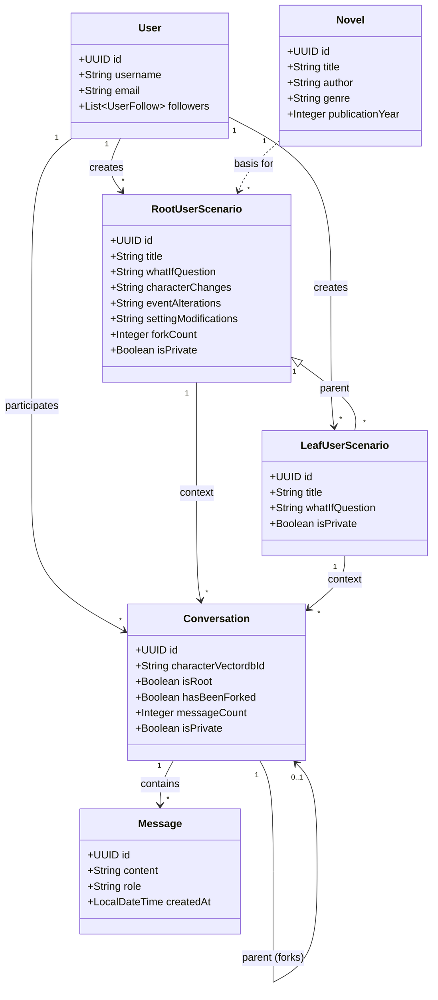

# System Class Diagram

## Domain Model

The class diagram below represents the core entity relationships in the Gaji backend.

### Key Entities
- **Novel**: Represents the source book/story.
- **RootUserScenario**: A user-created alternative timeline based directly on a Novel.
- **LeafUserScenario**: A fork of a RootUserScenario.
- **Conversation**: A chat session within a scenario.
- **User**: The platform user.

## Notes
- **Novel Content**: The actual text content of novels is stored separately in a Vector Database (VectorDB), not in the relational `Novel` table.
- **Characters**: Character definitions are also stored in VectorDB. `Conversation` entities reference characters via `characterVectordbId`.
- **Scenario Hierarchy**: 
    - `RootUserScenario` is a direct modification of a `Novel`.
    - `LeafUserScenario` is a modification of a `RootUserScenario` (Max Depth: 1).
