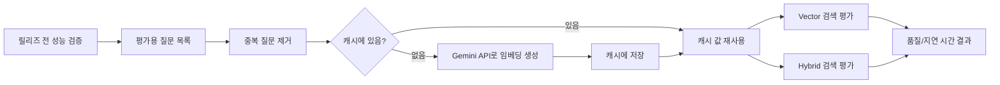
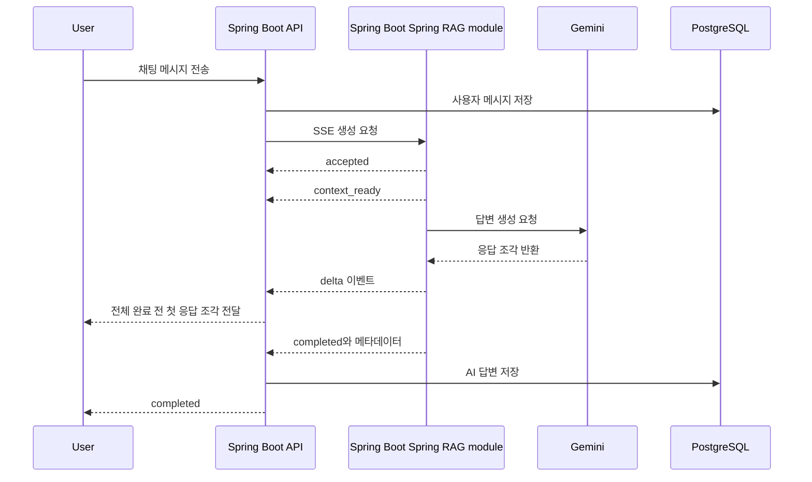
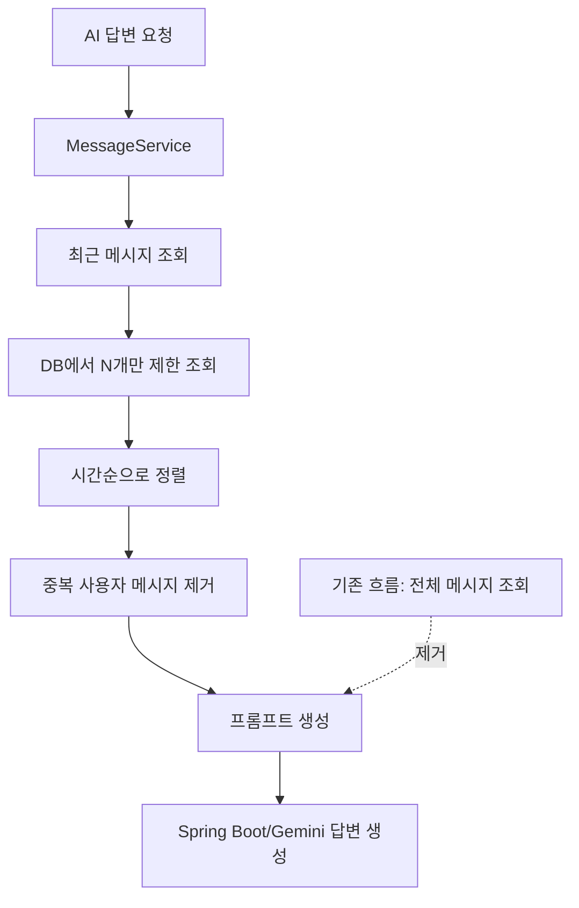
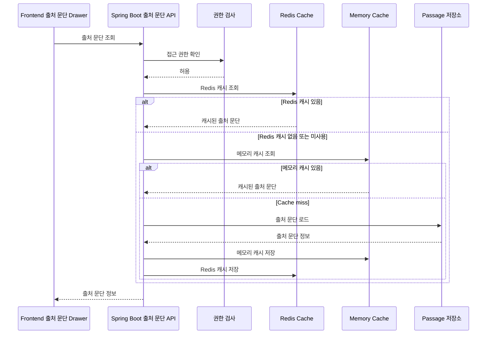
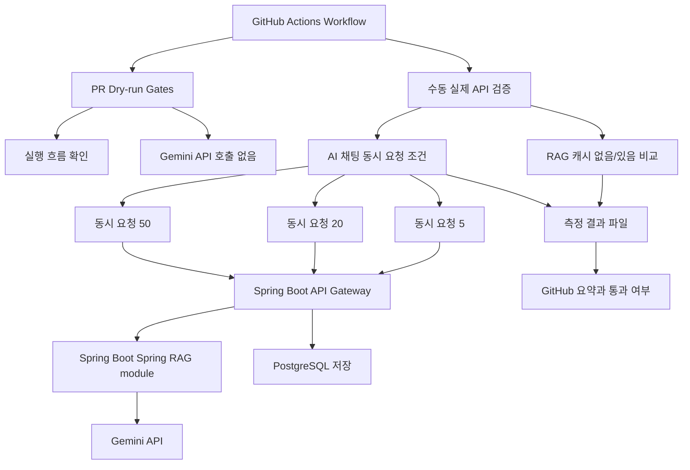

# Gaji 성능개선 포트폴리오 정리

Date: 2026-05-07

## 목적

이 문서는 Gaji 프로젝트에서 포트폴리오에 반영하기 좋은 성능개선 사례를 정리한다. 기존 포트폴리오의 `문제 상황 -> 해결 과정 -> 결과` 흐름에 맞춰, 구현 세부사항보다 어디서 시간이 늘어났고, 어떤 작업을 줄였고, 어떤 수치가 좋아졌는지 중심으로 작성했다.

## 표현 원칙

- 추상적인 표현보다 실제 흐름을 풀어쓴다.
  - 예: `API quota 최적화`보다 `Gemini API 호출이 반복되어 사용량 제한에 걸리는 문제를 줄임`
- 꼭 필요한 기술용어만 남긴다.
  - 유지할 용어: `RAG`, `Elasticsearch`, `SSE`, `Redis`, `p95`
  - 풀어쓸 용어: `BM25` -> `키워드 검색`, `vector` -> `의미 기반 검색`, `hybrid` -> `혼합 검색`, `Embedding Cache` -> `캐시`, `릴리즈 게이트` -> `배포 전 성능 검증`
- 수치가 있는 사례는 수치를 앞에 둔다.
  - 예: `캐시 재실행 Gemini Embedding API 재호출 0회`, `first-delta p50 1171.2 ms`

## 추천 우선순위

| 우선순위 | 사례 | 포트폴리오 적합도 | 이유 |
| --- | --- | --- | --- |
| 1 | RAG 평가 질문 캐시 | 높음 | 같은 질문을 반복해서 Gemini API에 보내지 않도록 줄인 사례 |
| 2 | SSE 기반 AI 채팅 응답 개선 | 높음 | 전체 답변 전 첫 응답 조각을 먼저 보여줘 체감 대기 시간을 줄인 사례 |
| 3 | 장기 대화 프롬프트 생성 최적화 | 중간-높음 | 대화가 길어져도 최근 메시지만 읽도록 바꾼 DB 조회 개선 |
| 4 | RAG 출처 문단 조회 캐시 | 중간 | 같은 출처 문단을 반복 조회하지 않도록 줄인 보조 성능개선 |
| 5 | AI 채팅 동시 요청 성능 검증 | 중간 | 동시 요청 성능을 같은 기준으로 반복 측정할 수 있게 만든 사례 |

## 운영 문제 해결형 포장 방향

Gaji는 아직 장기 운영 서비스라고 말하기보다, **운영 중 충분히 발생할 수 있는 문제를 릴리즈 전 검증 과정에서 발견하고 개선한 사례**로 포장하는 것이 안전하다. 특히 이 JD는 LLM 기반 데이터 파이프라인과 검색 시스템 운영을 보므로, 아래처럼 "운영 시나리오" 중심으로 풀어쓰는 편이 좋다.

### 전체 스토리

```text
RAG 기반 AI 채팅 기능을 구현한 뒤, 실제 사용량이 늘어났을 때 문제가 될 수 있는 반복 Gemini API 호출, 긴 대화의 DB 조회 증가, AI 응답 대기 시간, 출처 문단 반복 조회 문제를 배포 전 성능 검증 과정에서 확인했습니다.
이후 캐시, SSE, 최근 메시지 제한 조회, Redis 전환 가능한 출처 문단 캐시를 적용해 운영 중 비용과 지연이 커질 수 있는 지점을 줄였습니다.
```

### JD 맞춤 한 줄 소개

```text
LLM 기반 RAG 검색 흐름에서 질문 임베딩, 검색, 답변 생성, 출처 문단 조회까지 이어지는 경로를 점검하고, 반복 API 호출과 불필요한 DB 조회를 줄여 운영 시 발생할 수 있는 비용과 지연 문제를 개선했습니다.
```

### 면접에서 말하기 좋은 문제 정의

```text
AI 기능은 단순히 답변이 나오는 것만으로는 충분하지 않다고 봤습니다.
실제로 사용자가 늘어나면 같은 질문을 반복 임베딩하거나, 긴 대화의 전체 메시지를 계속 읽거나, 답변이 완성될 때까지 사용자가 기다리는 문제가 운영 비용과 UX 지연으로 이어질 수 있습니다.
그래서 RAG 검색과 AI 채팅 경로를 성능 검증 대상으로 보고, 반복 호출과 불필요한 조회를 줄이는 방향으로 개선했습니다.
```

### 과장하지 않는 표현

- "운영 장애를 해결했다"보다는 "운영 중 문제가 될 수 있는 병목을 릴리즈 전 검증에서 확인하고 개선했다"가 안전하다.
- "대규모 트래픽을 처리했다"보다는 "동시 요청 조건을 나눠 측정할 수 있는 검증 흐름을 만들었다"가 안전하다.
- "LLM 데이터 파이프라인을 운영했다"보다는 "텍스트를 RAG 검색에 사용할 수 있도록 나누고, 임베딩하고, 검색 품질을 검증하는 흐름을 다뤘다"가 더 정확하다.

## 1. RAG 평가 질문 캐시로 Gemini API 호출 감소

### 핵심 메시지

RAG 검색 품질을 평가할 때 같은 질문을 여러 번 임베딩하지 않도록 캐시에 저장해, Gemini API 호출 횟수와 평가 준비 시간을 줄였다.

### 문제 상황

- RAG 검색 품질 검증에서는 평가용 질문을 준비 단계, 의미 기반 검색, 혼합 검색, 지연 시간 측정 단계에서 반복 사용한다.
- 기존 구조에서는 같은 질문이라도 단계가 바뀔 때마다 다시 임베딩을 만들 수 있었다.
- 이 때문에 Gemini API 호출이 불필요하게 늘었고, 무료/개발용 사용량 제한에 걸리면 평가가 중간에 실패했다.

### 해결 과정

- 평가용 질문을 중복 제거한 뒤, 질문마다 한 번만 임베딩을 만들도록 준비 흐름을 바꿨다.
- 한 번 만든 임베딩은 캐시에 저장하고, 같은 질문이 다시 나오면 Gemini API를 호출하지 않고 캐시 값을 재사용했다.
- 캐시가 없는 첫 실행과 캐시가 채워진 재실행을 나눠 측정해, 최초 실행 비용과 반복 실행 비용을 따로 볼 수 있게 했다.

### 결과

| 항목 | Cold-cache | Warm-cache |
| --- | ---: | ---: |
| 중복 제거된 질문 수 | 45 | 45 |
| cache hits | 0 | 45 |
| cache misses | 45 | 0 |
| Gemini API로 임베딩한 질문 수 | 45 | 0 |
| 준비 시간 | 1144.528 ms | 3.632 ms |

### 포트폴리오 문장 예시

```text
RAG 검색 품질 검증에서 반복 사용되는 사용자 질문은 모델·차원·검색 용도가 같은 경우에만 검색용 벡터를 재사용하도록 개선했습니다.
캐시 재실행에서는 Gemini Embedding API 재호출 0회를 확인했고, 새 서비스 인스턴스 기준 준비 시간은 3.632ms로 측정했습니다.
```

### 데이터 플로우



## 2. SSE로 AI 첫 응답 대기 시간 감소

### 핵심 메시지

AI 답변이 모두 완성될 때까지 기다리지 않고, 첫 응답 조각을 먼저 보내 사용자 체감 대기 시간을 줄였다.

### 문제 상황

- AI 채팅 응답은 Gemini API 호출 시간이 대부분을 차지한다.
- 전체 응답이 완성될 때까지 기다리면 사용자는 2-3초 이상 아무 피드백 없이 대기하게 된다.
- 단순 평균 응답 시간만 보면, 사용자가 "언제부터 답변을 보기 시작하는지"를 알기 어렵다.

### 해결 과정

- Spring Boot 채팅 API와 Spring Boot AI 생성 API를 SSE streaming 경로로 연결했다.
- 응답 이벤트를 `accepted`, `context_ready`, `delta`, `completed`, `error`로 나눠 전달했다.
- 릴리즈 전 성능 검증에서 전체 응답 시간과 첫 응답 조각(first-delta) 도착 시간을 따로 측정했다.

### 결과

실제 Gemini API를 붙인 streaming chat 검증 기준:

| 항목 | 값 |
| --- | ---: |
| measured requests | 100 |
| 전체 응답 p50 | 2160.8 ms |
| 전체 응답 p95 | 3371.9 ms |
| 첫 응답 조각 p50 | 1171.2 ms |
| 첫 응답 조각 p95 | 2155.2 ms |
| fallback count | 0 |
| 인용 원문 과다 노출 | 0 |
| 프롬프트 내부 문구 노출 | 0 |

### 포트폴리오 문장 예시

```text
Gemini 기반 AI 채팅 경로를 SSE로 바꿔, 전체 답변이 끝나기 전에 첫 응답 조각을 먼저 전달하도록 개선했습니다.
100개 요청 기준 전체 응답 p50은 2160.8ms였지만 첫 응답 조각은 p50 1171.2ms에 도착해, 사용자가 약 1초 먼저 답변을 보기 시작할 수 있게 했습니다.
```

### 시퀀스 다이어그램



## 3. 장기 대화에서 최근 메시지만 읽도록 프롬프트 생성 개선

### 핵심 메시지

AI 답변 생성에 필요한 최근 메시지만 DB에서 읽도록 바꿔, 대화가 길어질수록 조회량이 늘어나는 문제를 줄였다.

### 문제 상황

- 기존 프롬프트 생성 로직은 대화 전체 메시지를 조회한 뒤, 애플리케이션에서 최근 메시지만 잘라 사용했다.
- 실제 AI 답변에는 최근 7개 메시지만 필요했지만, 대화가 길어질수록 DB에서 읽는 메시지 수가 계속 늘어났다.
- staging smoke 대화는 이미 701개 메시지까지 누적되어, 장기 대화에서 불필요한 DB 조회가 커질 수 있는 상태였다.

### 해결 과정

- 프롬프트 생성 단계에서 전체 메시지를 읽는 흐름을 제거했다.
- DB 조회 단계에서 최근 N개 메시지만 가져오도록 `findRecentByConversationId(..., Pageable)` 경로를 사용했다.
- 조회한 메시지는 시간순으로 정렬한 뒤 프롬프트에 넣고, 현재 사용자 메시지가 중복으로 들어가지 않도록 걸러냈다.
- 최근 메시지 개수와 최대 답변 길이는 `AI_CHAT_RECENT_HISTORY_MESSAGE_LIMIT`, `AI_CHAT_MAX_OUTPUT_TOKENS` 설정으로 조정할 수 있게 했다.

### 결과

- 701개 이상 누적된 대화에서도 프롬프트 생성에는 최근 메시지만 조회하도록 변경했다.
- 대화가 길어져도 프롬프트 생성에 필요한 DB 조회량과 메모리 사용량이 계속 증가하지 않도록 개선했다.
- 아직 별도 benchmark 수치는 없으므로, 포트폴리오에는 "대화 길이에 따른 불필요한 조회 증가 차단" 중심으로 표현하는 것이 안전하다.

### 포트폴리오 문장 예시

```text
AI 답변 생성에는 최근 일부 메시지만 필요했지만, 기존 구조는 대화 전체 메시지를 조회한 뒤 잘라 사용했습니다.
최근 N개 메시지만 DB에서 직접 조회하도록 변경해, 701개 이상 누적된 장기 대화에서도 프롬프트 생성 비용이 대화 길이에 비례해 증가하지 않도록 개선했습니다.
```

### 데이터 플로우



## 4. RAG 출처 문단 조회 캐시로 반복 조회 감소

### 핵심 메시지

사용자가 같은 답변의 출처 문단을 다시 열 때, 같은 데이터를 반복 조회하지 않도록 캐시를 추가했다.

### 문제 상황

- RAG 답변은 어떤 문장을 근거로 답했는지 citation 정보를 제공한다.
- 사용자가 같은 답변의 출처 문단 drawer를 여러 번 열면, 같은 문단 정보를 반복 조회할 수 있다.
- Spring RAG module가 여러 인스턴스로 늘어나면, 서버 메모리 캐시만으로는 인스턴스마다 캐시가 따로 쌓이는 문제가 생긴다.

### 해결 과정

- Spring Boot의 출처 문단 조회 API에 짧은 시간 유지되는 캐시를 추가했다.
- 권한 검사는 캐시 조회보다 먼저 수행해, 캐시가 다른 사용자의 출처 문단 접근을 허용하지 않도록 했다.
- 기본값은 서버 메모리 캐시로 두고, `RAG_SOURCE_LOOKUP_CACHE_BACKEND=redis` 설정 시 Redis 캐시를 사용할 수 있게 했다.
- Redis 장애 시에는 서버 메모리 캐시로 fallback해 로컬 개발과 테스트 안정성을 유지했다.

### 결과

- 같은 novel ID와 passage ID 조합에 대한 반복 조회를 캐시로 처리할 수 있게 됐다.
- 로컬 환경은 단순 메모리 캐시를 유지하면서, staging/production에서는 Redis 캐시로 전환할 수 있다.

### 포트폴리오 문장 예시

```text
RAG 답변의 출처 문단 drawer를 반복해서 열 때 같은 문단 정보가 다시 조회되는 문제를 줄이기 위해 캐시를 추가했습니다.
권한 검사를 캐시 조회보다 먼저 수행하고, 로컬은 메모리 캐시, 운영 환경은 Redis 캐시를 사용할 수 있게 분리했습니다.
```

### 시퀀스 다이어그램



## 5. AI 채팅 동시 요청 성능을 같은 기준으로 검증

### 핵심 메시지

AI 채팅 성능을 수동으로 한 번 재는 데서 끝내지 않고, 같은 조건으로 반복 측정할 수 있는 검증 흐름을 만들었다.

### 문제 상황

- AI 채팅은 Gemini API 호출 시간, Spring Boot 프록시, Spring Boot 답변 생성, DB 저장 시간이 함께 섞여 있다.
- 동시 요청이 늘어날 때 어디서 시간이 늘어나는지 보려면 같은 조건으로 반복 측정해야 한다.
- 실제 Gemini API를 호출하는 검증을 모든 PR에서 실행하면 API 사용량과 secret 관리 부담이 커진다.

### 해결 과정

- GitHub Actions에서 Gemini API를 호출하지 않는 dry-run 검증과, 실제 Gemini API를 붙여 실행하는 수동 검증을 분리했다.
- 실제 검증에는 동시 요청 `5,20,50` 조건을 추가했다.
- 답변 길이 p95 기준을 추가해, 답변이 과도하게 길어져 응답 시간과 토큰 비용이 늘어나는 상황을 감지하도록 했다.
- 결과 파일과 GitHub job summary에 전체 응답 p95, 첫 응답 조각 p95, 답변 길이 p95, fallback, 내부 문구 노출 여부를 남기도록 구성했다.

### 결과

- PR에서는 Gemini API를 쓰지 않는 dry-run으로 설정과 실행 흐름을 검증할 수 있다.
- 수동 검증에서는 staging 데이터와 secret을 사용해 실제 동시 요청 성능을 측정할 수 있다.
- 현재 `5,20,50` 실제 측정 결과는 별도 staging 실행이 필요하므로, 포트폴리오에서는 "검증 흐름을 추가했다" 중심으로 표현하는 것이 안전하다.

### 포트폴리오 문장 예시

```text
AI 채팅 경로의 성능을 같은 기준으로 반복 확인하기 위해 dry-run 검증과 실제 Gemini API 검증을 분리했습니다.
또한 5/20/50 동시 요청 조건과 답변 길이 p95 기준을 추가해, staging 환경에서 전체 응답 p95와 첫 응답 조각 p95를 함께 측정할 수 있게 했습니다.
```

### 아키텍처 다이어그램



## 포트폴리오 반영 추천

### 2페이지로 압축하는 경우

1. `RAG 평가 질문 캐시`
   - 가장 성능개선 수치가 선명하다.
   - Gemini API 호출 감소와 평가 시간 개선이 함께 드러난다.

2. `SSE 기반 AI 채팅 응답 개선`
   - AI 서비스 UX 성능개선 사례로 좋다.
   - 첫 응답 조각 p50/p95라는 사용자 체감 지표가 강하다.

### 3페이지로 확장하는 경우

위 2개에 `장기 대화 프롬프트 생성 최적화`를 추가한다. 수치 benchmark는 없지만, 장기 대화에서 불필요한 DB 조회 증가를 차단한 구조 개선으로 설명하기 좋다.

### 주의해서 써야 할 표현

- `5/20/50` 동시 요청 검증은 실행 흐름은 추가됐지만, 실제 Gemini API를 붙인 결과는 아직 별도 staging 실행이 필요하다.
- 따라서 "5/20/50 부하 테스트 결과 개선"이 아니라 "5/20/50 동시 요청 성능 검증 흐름을 추가"라고 표현하는 것이 안전하다.
- 장기 대화 프롬프트 생성 개선은 실제 p95 수치가 없으므로 "701개 이상 누적된 대화에서도 최근 메시지만 조회하도록 개선"처럼 구조적 개선으로 적는 편이 좋다.

## 최종 추천 문장

```text
Gaji에서는 RAG 검색과 AI 채팅 기능을 만든 뒤, 실제로 얼마나 빠르고 안정적으로 동작하는지 릴리즈 전에 검증하는 흐름을 함께 구성했습니다.
반복되는 평가 질문은 캐시에 저장해 Gemini API 호출을 줄였고, SSE로 첫 응답 조각을 먼저 보내 체감 대기 시간을 낮췄습니다.
또한 장기 대화에서는 전체 메시지를 읽지 않고 최근 메시지만 조회하도록 바꿔, 대화 길이에 따른 DB 조회 증가를 차단했습니다.
```
