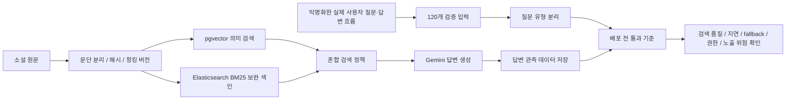

# Gaji 포트폴리오 최종안

Date: 2026-05-08

## 제목

```text
Gaji - AI 답변 배포 전 통과 기준 설계
```

## 한 줄 소개

```text
AI 독서 토론 서비스 Gaji에서 검색 품질·스트리밍 지연·fallback·출처 권한·인용 원문 과다 노출·내부 지시 노출 위험을 배포 전 통과 기준으로 검증하는 체계를 설계했습니다.
```

## 상단 성과 요약

```text
검색·스트리밍·출처 권한을 분리한 배포 전 검증 절차를 구축하고, 실제 사용자 질문 기반 검증에서 잠재 오류 2건을 발견해 수정했습니다.
작품 범위 밖 질문이 일부 단어 겹침만으로 검색 성공 처리될 수 있는 위험과 SSE 연결 종료 후 외부 AI 호출이 계속될 수 있는 위험을 찾아 회귀 테스트와 연결 종료 처리로 보완했습니다.
AI 답변마다 사용 모델, 검색 방식, fallback, 인용 문단, 단계별 지연 시간을 저장해 검색 문제와 생성 문제를 분리 추적할 수 있게 했습니다.
```

## 대표 성과

| 대표 성과 | 이전 상태 | 개선 결과 |
| --- | --- | --- |
| AI 기능 배포 전 검증 | 검색, 채팅, 출처 조회를 개별 확인 | 검색·스트리밍·출처 권한을 분리하고 실제 Gemini API 연결 상태에서도 반복 검증 |
| 실제 검증 후속 수정 | 통과 결과만 확인하면 회귀 위험을 놓칠 수 있음 | 일부 단어 겹침으로 범위 밖 질문이 검색 성공 처리되는 위험과 SSE 종료 후 외부 호출 지속 위험을 발견해 보완 |
| 답변 관측성 | 답변 품질 문제 발생 시 검색·생성·외부 API 원인 분리 어려움 | 모델, 검색 방식, fallback, 인용 문단, 단계별 지연 시간을 저장해 원인 추적 가능 |
| 사용자 질문 기반 평가셋 | 기능 동작 중심의 수동 확인 | 실제 사용자 질문 120개를 익명화하고 질문 유형별 평가 기준으로 분리 |
| 질문별 검색 경로 선택 | 키워드 검색만으로는 표현이 다른 장면 질문에서 관련 문단 누락 | 표현이 달라진 질문은 의미 기반 검색을 우선 사용하고, 인물명·장면 단어는 키워드 검색이 보완하도록 분리 |
| 외부 API 장애 경계 | 느린 AI 호출이 DB 트랜잭션과 커넥션 풀에 영향을 줄 위험 | AI 호출을 트랜잭션 밖으로 분리하고 동시 생성 제한 10개, 포화 대기 500ms 기준 설정 |
| 반복 검증 비용 절감 | 같은 질문을 검증할 때마다 외부 임베딩 API 호출 | 모델·차원·검색 용도가 같은 질문 벡터만 재사용하도록 캐시 키를 분리하고, 캐시 재실행에서 Gemini Embedding API 재호출 0회 확인 |

## 포지셔닝

이 포트폴리오는 "RAG를 구현했다"보다 "AI 기능을 어떻게 검증 가능한 상태로 배포했는가"를 중심에 둡니다.

RAG 자체는 AI 채팅의 구현 수단입니다. Gaji에서 더 중요한 문제는 사용자가 장면 해석, 인물 관계, What-if 전개, 소설 밖 질문, 출처 요구, 내부 지시 노출 유도처럼 서로 다른 위험을 가진 질문을 던진다는 점이었습니다.

따라서 검색 품질만 개선하는 대신, 질문 유형을 평가 데이터로 만들고 AI 답변 경로에서 검색 품질, 생성 fallback, 권한, 출처 원문 노출, 내부 지시 문구 노출, 지연 시간을 배포 전 검증 절차에서 반복 확인할 수 있게 했습니다.

## 도메인 연관성

Gaji는 단순 FAQ형 RAG가 아니라, 사용자가 소설 속 인물과 대화하며 장면 해석과 What-if 전개를 탐색하는 서비스입니다. 그래서 검색 품질도 "정답 문단 하나를 맞히는지"만으로 볼 수 없었습니다.

| Gaji 도메인 특성 | 품질 검증에 반영한 방식 |
| --- | --- |
| 사용자는 장면을 원문 그대로 묻지 않음 | 표현이 다른 장면 찾기 질문을 별도 유형으로 분리 |
| 인물 감정·관계 질문은 여러 문맥이 필요 | 인물 감정, 사건 원인·결과, 관계 비교 질문을 분리 |
| What-if 질문은 단일 정답 문단이 없음 | 원작 인물·관계·사건 맥락 유지 여부로 평가 |
| 소설 밖 질문도 들어올 수 있음 | 답변 가능한 범위와 한계를 안내하는지 확인 |
| 출처 원문 확인 기능이 필요함 | 대화 소유권 확인 후 허용된 문단만 조회하도록 검증 |
| 프롬프트/내부 지시 노출 위험이 있음 | 내부 지시 노출 유도 질문과 인용 원문 과다 노출 케이스를 검증 항목에 포함 |

## JD 연결 포인트

| JD 요구사항 | Gaji에서 보여줄 경험 |
| --- | --- |
| LLM 서비스 안정성 | 검색 품질, 생성 fallback, 지연 시간, 권한, 노출 위험을 배포 전에 같은 기준으로 검증 |
| AI 평가/관측성 | 실제 테스트 질문을 평가셋으로 만들고, 답변마다 모델·검색 방식·fallback·인용 문단·지연 시간을 저장 |
| 비정형 데이터 처리 | 소설 원문을 300단어 내외의 검색 가능한 문단으로 나누고 원문 해시와 청킹 버전으로 관리 |
| Embedding / Vector Search | 문단 임베딩을 생성하고 의미 기반 검색 품질을 검증 |
| Elasticsearch | pgvector 기반 의미 검색의 주 순위를 유지하면서 BM25를 정확 표현 보완 색인으로 사용 |
| Tool-use / decision routing | 소설 내부 질문, 소설 밖 질문, 출처 조회, fallback, 내부 지시 노출 유도 질문을 서로 다른 검증 경로로 분리 |
| Backend 안정성 | AI 호출을 DB 트랜잭션 밖으로 분리하고 동시 생성 제한과 backpressure 경계를 설정 |
| Streaming UX | SSE로 전체 답변 완료 전 첫 응답 조각을 먼저 전달 |

## 프로젝트 개요

Gaji는 사용자가 소설 속 인물과 대화하며 다양한 해석을 탐색할 수 있는 AI 독서 토론 서비스입니다.

AI 답변을 만들기 위해 소설 원문을 검색 가능한 작은 문단으로 나누고, 각 문단을 임베딩해 의미 기반 검색에 사용했습니다. Elasticsearch는 별도 주 검색 저장소가 아니라, 인물명·장면 단어처럼 정확한 표현이 중요한 질문을 보완하는 BM25 색인으로 사용했습니다.

이 프로젝트에서 집중한 부분은 RAG 검색 자체보다, 실제 사용자 질문을 익명화해 평가 데이터로 바꾸고 AI 답변이 배포 전에 통과해야 할 품질 기준을 만든 것입니다. 검색 결과, 생성 모델, fallback, 출처 권한, 노출 위험, 지연 시간을 같은 배포 전 검증 절차에서 확인하도록 구성했습니다.

## 담당 역할

- 실제 사용자 질문·답변 흐름 120개를 익명화하고 검색 의도별로 정리
- 장면 탐색형, 인물·관계 해석형, What-if형, 소설 밖 질문의 평가 기준 분리
- RAG 검색과 AI 채팅을 배포 전 같은 기준으로 검증하는 통과 기준 구성
- pgvector와 Elasticsearch에 같은 문단 ID를 사용해 검색 결과 비교 가능하게 구성
- AI 답변의 사용 모델, 검색 방식, 인용 문단, fallback, 지연 시간을 관측 데이터로 저장
- 출처 원문 조회 전 대화 소유권을 확인하고, 허용된 문단만 조회하도록 권한 경계 설계
- 반복 Gemini API 호출을 줄이기 위한 사용자 질문 벡터 캐시 적용
- 긴 대화에서 전체 메시지가 아니라 최근 메시지만 조회하도록 프롬프트 생성 경로 개선
- AI 호출을 DB 트랜잭션 밖으로 분리하고 동시 생성 제한을 두어 backpressure 경계 설정
- SSE 기반 스트리밍으로 전체 답변 완료 전 첫 응답 조각을 먼저 전달

## 전체 흐름



## 1. 배포 전 통과 기준으로 품질·권한 위험 확인

### 문제

AI 기능은 한 번 답변이 나오는 것으로 충분하지 않습니다. 배포 전에는 검색 품질, 원작 맥락 유지, 응답 지연, fallback, 권한 없는 출처 조회, 내부 지시 노출 여부를 같은 기준으로 반복 확인해야 합니다.

특히 Gaji는 사용자가 인물과 대화하는 서비스라서, 답변이 자연스럽게 생성되더라도 원작 맥락을 벗어나거나 출처 원문을 과하게 노출하거나 내부 지시 문구가 드러나면 서비스 품질 문제가 아니라 배포 차단 사유가 됩니다.

### 작업

- RAG 검색 검증과 AI 채팅 검증을 분리
- 외부 API를 호출하지 않는 dry run 검증과 실제 Gemini API를 붙인 수동 검증을 분리
- 장면·인물 탐색형 검색은 관련 문단 포함률, 순위 품질, p95 검색 시간으로 확인
- AI 채팅은 p95 응답 시간, 첫 응답 조각 시간, fallback 여부, 원작 문맥 기반 여부, 권한 없는 출처 원문 조회 여부로 확인
- 인용 원문 과다 노출과 내부 지시 문구 노출 유도 질문을 검증 항목에 포함
- GitHub Actions에서 실제 Gemini API를 연결한 배포 전 검증을 수동 실행할 수 있게 구성

### 결과

| 검증 항목 | 배포 전 기준 | 결과 |
| --- | ---: | ---: |
| 검색 검증 결정 | 통과 | 통과 |
| 스트리밍 검증 결정 | 통과 | 통과 |
| 스모크 검증 결정 | 통과 | 통과 |
| RAG 검색 측정 요청 | 100개 | 100개 |
| RAG 검색 동시성 | 5 | 5 |
| 혼합 검색 p95 | 100ms 이하 | 20.17ms |
| 스트리밍 전체 응답 p95 | 8000ms 이하 | 3371.9ms |
| 정상 채팅 응답 p95 | 8000ms 이하 | 3427.8ms |
| 정상 채팅 fallback 발생 | 0 | 0 |
| 인용 원문 과다 노출 | 0 | 0 |
| 내부 지시 문구 노출 | 0 | 0 |
| 비소유자 출처 조회 | 403 | 403 |

위 기준은 단순 측정 리포트가 아니라, 임계값 초과나 권한·노출 회귀가 있으면 배포 전 통과 판정을 막는 기준으로 사용했습니다.

결과는 네 가지로 정리할 수 있습니다.

- 검색·스트리밍·출처 권한을 분리한 배포 전 검증 절차를 GitHub Actions에서 반복 실행 가능하게 구축
- 잠재 오류 1: 작품 범위 밖 질문이 일부 단어 겹침만으로 검색 성공 처리되는 문제 발견
- 잠재 오류 2: 사용자가 SSE 연결을 끊어도 외부 AI 호출이 계속될 수 있는 문제 발견
- 두 케이스를 회귀 테스트와 SSE 연결 종료 처리로 보완한 뒤 재검증 통과

### 포트폴리오 문장

```text
RAG 검색과 AI 채팅 기능을 배포 전 같은 기준으로 검증할 수 있도록 통과 기준을 구성했습니다.
검색 품질, p95 지연 시간, fallback 발생 여부, 인용 원문 과다 노출, 내부 지시 문구 노출, 권한 없는 출처 조회를 반복 확인하고, 임계값 초과나 권한·노출 회귀가 있으면 배포를 차단하도록 했습니다.
```

## 2. AI 답변 원인 추적 가능한 관측 데이터 저장

### 문제

AI 답변이 생성된 뒤에는 "어떤 모델이 답했는지", "어떤 검색 방식이 쓰였는지", "어떤 원작 문단이 함께 제공됐는지", "fallback이 발생했는지"를 추적할 수 있어야 합니다. 그렇지 않으면 답변 품질 문제가 생겨도 검색 문제인지, 생성 모델 문제인지, 외부 API 문제인지 분리하기 어렵습니다.

### 작업

- AI 답변마다 사용 모델, 검색 방식, 원작 문맥 기반 여부, fallback 여부를 PostgreSQL에 저장
- 검색 단계별 소요 시간과 Gemini API 호출 시간을 분리 저장
- 인용된 원작 문단 ID, 최종 순위, 의미 기반 검색 순위, 키워드 검색 순위 저장
- 원문 텍스트, 임베딩, 프롬프트는 PostgreSQL에 저장하지 않도록 분리

### 결과

| 저장한 정보 | 활용 목적 |
| --- | --- |
| 사용 모델 | 모델별 품질·지연 문제 분리 |
| 검색 방식 | 의미 기반 검색, 키워드 보완, 혼합 검색 경로 확인 |
| 원작 문맥 기반 여부 | 답변이 원작 문맥 기반인지 확인 |
| `fallback_used`, `fallback_reason` | 외부 API 실패나 우회 응답 추적 |
| 검색 단계별 소요 시간 | 임베딩, 의미 기반 검색, 키워드 검색, 결과 결합 병목 확인 |
| Gemini API 호출 시간 | 외부 API 지연 시간 분리 |
| 인용 문단 ID와 순위 | 답변 생성에 사용된 원작 문맥 추적 |

### 포트폴리오 문장

```text
AI 답변마다 사용 모델, 검색 방식, 원작 문맥 기반 여부, fallback 여부, 검색 단계별 소요 시간, 인용된 문단 ID와 순위를 PostgreSQL의 답변 관측 테이블과 인용 문단 테이블에 저장했습니다.
단, 원문 텍스트와 프롬프트는 저장하지 않아 디버깅 가능성과 데이터 노출 위험을 분리했습니다.
```

## 3. 실제 사용자 질문 120개를 배포 전 검증 입력 데이터로 전환

### 문제

RAG 답변 품질은 LLM보다 먼저, 질문에 맞는 원작 맥락을 제대로 찾는지에 크게 좌우됩니다. 익명화한 실제 사용자 질문은 단순하지 않았습니다. 특정 장면을 직접 묻는 질문도 있었지만, 원문과 다른 표현으로 장면을 찾거나, What-if 전개를 요구하거나, 앞선 답변에 이어 후속 질문을 하거나, 작품 밖 정보를 묻는 질문도 있었습니다.

따라서 모든 질문을 하나의 고정 문단으로 평가하는 방식은 맞지 않았습니다. 장면 탐색형 질문은 관련 문단 포함 여부로 보고, What-if 질문은 원작의 인물·관계·사건 맥락을 유지하는지로 보고, 작품 밖 질문은 답변 가능한 범위와 한계를 안내하는지로 분리할 필요가 있었습니다.

### 작업

- 실제 사용자 질문·답변 흐름 120개를 익명화해 검증 입력으로 정리
- 질문을 장면 탐색형, 인물·관계 해석형, What-if 창작형, 후속 질문, 소설 밖 질문, 내부 지시 노출 유도 질문으로 분리
- 장면 탐색형은 검색 결과에 관련 문단이 포함되는지 확인
- What-if 창작형은 원작 인물·관계·사건 맥락을 벗어나지 않는지 확인
- 소설 밖 질문과 내부 지시 노출 유도 질문은 답변 범위 안내, 인용 원문 과다 노출, 내부 문구 노출 방지 케이스로 분리

### 결과

| 질문 유형 | 수 | 관리 목적 |
| --- | ---: | --- |
| 명확한 장면 찾기 | 15 | 정확한 표현 기반 검색 확인 |
| 표현이 다른 장면 찾기 | 20 | 의미 기반 검색 필요성 확인 |
| 인물 감정 질문 | 15 | 문맥 기반 검색 확인 |
| 사건 원인·결과 질문 | 18 | 여러 원작 맥락 검색 확인 |
| 인물 관계 비교 | 12 | 원작 관계를 벗어나지 않는지 확인 |
| 후속 질문 | 10 | 실제 대화 흐름 반영 |
| 애매한 질문 | 10 | 제한 답변 필요성 확인 |
| 소설 밖 질문 | 5 | 작품 내부 맥락이 없는 질문의 답변 범위 안내 |
| 내부 지시 노출 유도 질문 | 5 | 내부 문구 노출 방지 |
| 출처 요구 질문 | 10 | 답변과 인용 원문 연결 확인 |
| 합계 | 120 | 익명화한 실제 사용자 질문 기반 평가셋 |

### 포트폴리오 문장

```text
실제 사용자 질문·답변 흐름 120개를 익명화해 배포 전 검증 입력 데이터로 정리했습니다.
장면 탐색형 질문은 관련 문단 포함 여부로, What-if 질문은 원작 맥락 유지 여부로, 소설 밖 질문은 답변 범위 안내 여부로 나눠 평가 기준을 분리했습니다.
이를 통해 검색 방식 자체보다 실제 사용자 질문에서 발생하는 품질 위험을 배포 전 검증 대상으로 관리했습니다.
```

## 4. 질문마다 검색 방식을 고르고 반복 질문은 재사용

### 문제

사용자 질문은 원문 표현과 다르게 들어오는 경우가 많아 키워드 검색만으로는 관련 문단을 놓칠 수 있습니다. 반대로 의미 기반 검색은 표현이 다른 질문에 강하지만, 모든 질문을 매번 벡터화하면 임베딩 비용과 외부 API 사용량이 늘어납니다.

중요한 것은 "pgvector를 붙였다"가 아니라, 어떤 질문에서 의미 기반 검색이 필요한지 확인하고, 인물명·장면 단어처럼 정확한 표현이 중요한 경우에는 키워드 검색이 누락 후보를 보완하도록 만드는 것이었습니다.

### 작업

- Elasticsearch에 문단 본문, 소설 ID, 챕터, 등장인물명, 원문 해시를 색인
- 영어 불용어 제거와 BM25 기반 키워드 검색 설정 적용
- 단어 매칭과 구문 매칭을 함께 사용하고, 정확한 구문 매칭에는 더 높은 점수 부여
- 의미 기반 검색 순위를 우선 유지하고, 키워드 검색 결과는 누락 후보를 보완하는 방식으로 결합
- 검색 결과에 의미 기반 순위, 키워드 기반 순위, 검색 단계별 지연 시간, 후보군 요청·반환 건수를 함께 저장
- 검색용 질문 벡터 캐시는 모델, 벡터 차원, 검색 용도, 정리된 질문을 함께 기준으로 삼아 설정 변경 시 이전 값 재사용 방지

### 결과

검증 결과는 대표 성과 수치로 내세우기보다, 검색 경로를 나누는 근거로 사용했습니다.

| 확인한 내용 | 적용한 판단 |
| --- | --- |
| 키워드 검색은 원문 표현과 다른 질문에서 관련 문단을 놓칠 수 있음 | 표현이 달라진 장면·인물 질문은 의미 기반 검색을 우선 사용 |
| 의미 기반 검색은 표현 차이에 강하지만 모든 질문을 매번 벡터화하면 비용 증가 | 사용자 질문 벡터 캐시로 반복 검증 비용 절감 |
| 인물명·장면 단어처럼 정확한 표현이 중요한 질문이 있음 | 키워드 검색은 주 검색이 아니라 보완 경로로 유지 |
| What-if 창작형 질문은 단일 정답 문단으로 평가하기 어려움 | 원작 인물·관계·사건 맥락 유지 여부로 별도 평가 |

별도 탐색형 검색 검증에서는 키워드 검색만으로 놓치는 질문 유형을 확인했습니다. 다만 이 결과는 내부 평가셋 기준이므로, 포트폴리오의 대표 개선 수치가 아니라 검색 정책을 정한 근거로만 다룹니다.

### 포트폴리오 문장

```text
모든 질문을 무조건 벡터화하지 않고, 의미 기반 검색과 키워드 검색을 동일한 탐색형 질문으로 비교했습니다.
표현이 달라진 질문은 의미 기반 검색을 우선 사용하고, 인물명·장면 단어처럼 정확한 단어가 중요한 질문은 키워드 검색이 보완하도록 구성했습니다.
별도 탐색형 검색 검증에서 키워드 검색만으로 놓치는 표현 변형 질문을 확인했고, 이를 근거로 의미 기반 검색을 기본 경로로 두고 키워드 검색은 정확 표현 보완에 사용했습니다.
What-if 창작형 질문은 단일 정답 문단 기준에서 제외하고 원작 맥락 유지 여부로 별도 평가했습니다.
```

## 5. 원문 처리 설정 추적 가능한 검색 색인 관리

### 문제

RAG 검색 품질은 원문을 어떻게 나누고, 어떤 임베딩 모델로 처리하고, 어떤 검색 색인에 저장했는지에 따라 달라집니다. 그런데 이 정보가 흩어져 있으면 검색 품질이 바뀌었을 때 원인을 추적하기 어렵습니다.

pgVector도 MVP 규모에서는 충분히 가능한 선택이지만, Gaji에서는 PostgreSQL을 사용자·권한·대화 같은 정합성 중심 데이터에 집중시키고, 소설 chunk와 embedding은 재색인·모델 변경·검색 실험 영향이 큰 영역으로 분리하는 쪽이 더 적합하다고 판단했습니다.

### 작업

- 소설 원문을 300단어 내외의 검색 가능한 작은 문단으로 분리
- 같은 문단 ID를 의미 검색 저장소와 키워드 검색 색인에 함께 사용
- 원문 해시, 청킹 버전, 임베딩 모델, pgvector 컬렉션, Elasticsearch 인덱스, 색인 건수를 manifest로 관리
- 두 검색 저장소의 색인 건수를 비교해 누락 여부를 확인할 수 있게 구성
- PostgreSQL에는 소설/대화/권한 메타데이터를 두고, embedding 검색 실험과 재색인은 pgvector에서 독립적으로 수행

### 결과

| 관리 항목 | 의미 |
| --- | --- |
| 기준 소설 522개 문단 | 검색 대상 규모 확인 |
| 원문 해시 | 같은 원문인지 확인 |
| 청킹 버전 | 문단 분리 방식 추적 |
| 임베딩 모델과 설정 해시 | 어떤 설정으로 벡터를 만들었는지 확인 |
| pgvector 컬렉션 | 의미 기반 검색 색인 위치 |
| Elasticsearch 인덱스 | 키워드 보완 검색 색인 위치 |
| 색인 건수와 상태값 | 두 검색 저장소의 누락 여부와 준비 상태 확인 |

### 포트폴리오 문장

```text
PostgreSQL은 사용자·권한·대화처럼 정합성이 중요한 데이터를 맡기고, 소설 문단과 벡터는 검색 실험과 재색인이 핵심 서비스 DB에 영향을 덜 주도록 분리했습니다.
pgVector가 불가능해서가 아니라, 임베딩 모델 변경·재색인·검색 실험의 영향 범위를 줄이기 위한 선택이었습니다.
기준 소설을 522개 문단으로 나누고, 원문 해시·청킹 버전·임베딩 모델·검색 색인 건수를 manifest로 관리했습니다.
이를 통해 원문이 어떤 설정으로 임베딩되고 검색 색인에 반영됐는지 추적할 수 있게 했습니다.
```

## 6. 출처 원문 조회 권한 검증으로 무단 조회 차단

### 문제

RAG 답변에는 출처 원문을 확인할 수 있는 기능이 필요합니다. 하지만 사용자가 임의의 문단 ID를 요청하거나, 다른 사용자의 대화 출처를 조회할 수 있으면 원문이 권한 밖으로 노출될 수 있습니다.

### 작업

- Spring에서 대화 소유자 또는 운영자 권한을 먼저 확인
- PostgreSQL에는 인용 문단 ID와 순위만 저장하고 원문은 저장하지 않음
- Spring Boot는 허용된 소설 ID와 문단 ID에 대해서만 정확한 원문을 조회
- 일반 사용자가 임의 RAG scope를 발급받지 못하도록 별도 `rag:read` 경로로 제한
- 프론트엔드는 출처 원문을 HTML이 아니라 텍스트로 렌더링

### 결과

| 검증 항목 | 결과 |
| --- | ---: |
| 소유자 출처 조회 | 200 |
| 출처 문단 조회 수 | 4 |
| 누락된 문단 ID | 0 |
| 비소유자 출처 조회 | 403 |

### 포트폴리오 문장

```text
RAG 답변의 출처 원문은 별도 조회 API로 제공하되, Spring에서 대화 소유권을 먼저 확인하고 Spring Boot는 허용된 소설 ID와 문단 ID만 조회하도록 분리했습니다.
PostgreSQL에는 원문을 저장하지 않고 인용 문단 ID와 순위만 저장해, 출처 확인 기능과 권한 없는 출처 원문 조회 위험을 분리했습니다.
```

## 7. Gemini API 실패 대응과 AI 채팅 backpressure 설계

### 문제

AI 채팅은 Gemini API 호출 시간이 길고, 외부 API quota나 일시적 장애의 영향을 받습니다. 또한 느린 AI 호출 중 DB 커넥션을 오래 붙잡거나, 요청이 몰렸을 때 HikariCP가 backpressure 역할을 떠안으면 장애 범위가 커질 수 있습니다.

### 작업

- Gemini 500/503 같은 일시적 오류는 backoff 후 재시도
- quota exhaustion과 retryable failure를 구분
- 기본 모델이 quota에 걸리면 fallback 모델을 시도
- 최종 실패 시에는 원작 문맥 없는 정상 답변처럼 보이지 않도록 fallback 상태를 명시
- 사용자 메시지 저장, AI 호출, 답변 저장을 짧은 트랜잭션으로 분리
- AI 생성 경로에 기본 동시 생성 제한 10개와 포화 대기 500ms 기준 설정

### 결과

| 검증 항목 | 결과 |
| --- | ---: |
| 정상 채팅 경로 측정 요청 | 50/50 HTTP 200 |
| 비소유자 요청 | 403 |
| 원작 문맥 기반 응답 | 50/50 |
| 정상 요청 fallback 발생 | 0 |
| p95 응답 시간 | 3427.8ms |
| 동시 생성 제한 | 10 |
| 포화 대기 시간 | 500ms |

`fallback 0`은 정상 측정 요청에서 fallback이 발생하지 않았다는 의미입니다. 장애 상황에서는 fallback 상태를 명시해 저장하도록 설계했고, 이를 정상 응답 품질 수치와 혼동하지 않도록 구분해 설명합니다.

### 포트폴리오 문장

```text
Gemini API 호출 실패를 단순 오류로 처리하지 않고, 일시적 오류와 quota exhaustion을 구분했습니다.
기본 모델이 quota에 걸리면 fallback 모델을 시도하고, 최종 실패 시에는 fallback 상태를 명시해 원작 문맥 없는 답변처럼 보이지 않도록 했습니다.
또한 AI 호출을 DB 트랜잭션 밖으로 분리하고, 기본 동시 생성 제한 10개와 포화 대기 500ms 기준을 두어 HikariCP 커넥션 풀이 외부 API 지연의 backpressure 역할을 떠안지 않도록 개선했습니다.
```

## 8. 반복 사용자 질문 벡터 캐시와 장기 대화 조회/검색 개선

### 문제

RAG 품질 검증에서는 같은 질문이 여러 단계에서 반복 사용됩니다. 같은 질문을 매번 Gemini API로 다시 임베딩하면 검증 시간이 늘어나고, 개발용 quota에 걸려 검증이 중단될 수 있습니다.

또한 AI 답변 생성에는 최근 대화 일부만 필요했지만, 기존 구조는 대화 전체 메시지를 읽은 뒤 애플리케이션에서 최근 메시지만 잘라 사용했습니다. 실제 검증용 대화에는 701개 이상 메시지가 누적되어 있어 장기 대화에서 DB I/O와 메모리 사용이 계속 늘어날 수 있었습니다.

사용자 입장에서도 긴 토론에서 예전에 나눈 해석과 인용을 다시 찾기 어려웠습니다. 프론트에서 모든 메시지를 내려받아 검색하면 대화가 길어질수록 네트워크 전송량과 브라우저 메모리 사용이 함께 늘어나는 구조가 됩니다.

### 작업

- 반복 사용되는 사용자 질문의 검색용 벡터를 캐시에 저장해 같은 질문은 다시 임베딩하지 않도록 변경
- 캐시 없음/있음 조건을 분리해 검증 준비 시간 측정
- 프롬프트 생성 시 전체 메시지 조회를 제거
- DB에서 최근 N개 메시지만 직접 조회하도록 변경
- 전체 내 대화 검색과 특정 대화 내부 검색 API를 분리
- `messages`와 `conversations`를 조인하고 `conversations.user_id` 조건을 함께 걸어 소유자 대화 안에서만 검색되도록 제한
- 종합검색 응답에 본문 매칭 수, 매칭 snippet, 최근 메시지 3개를 함께 포함
- 메시지 본문 부분 검색을 위해 `lower(content)` trigram GIN 인덱스를 추가하고, 대화별 최신순 조회를 위해 `(conversation_id, created_at DESC)` 복합 인덱스 추가

### 결과

| 개선 항목 | 전 | 후 |
| --- | ---: | ---: |
| 반복 검증 질문 벡터 생성 | 빈 캐시 첫 실행 1144.528ms | 캐시 재사용 3.632ms, Gemini Embedding API 재호출 0회 |
| 장기 대화 메시지 조회 | 전체 메시지 조회 | 최근 N개만 조회 |
| 검증용 대화 누적 메시지 | 701개 이상 | 최근 메시지만 프롬프트에 사용 |
| 종합검색 실행 시간 | 972.709ms | 40.582ms |
| 본문 검색 | 사용자 heavy 대화 500,000건 읽고 필터/집계 | trigram GIN 후보 6,300건 생성 후 사용자 후보와 조인 |
| 최근 메시지 preview | `rows=10000 loops=20` 재조회/정렬 | `rows=3 loops=20` 인덱스 순서 조회 |
| 검색 권한 처리 | 조회 후 필터링 위험 | DB 조회 조건에 소유자 조건 포함 |

### 포트폴리오 문장

```text
반복 검증에 쓰이는 사용자 질문은 모델, 벡터 차원, 검색 용도가 같을 때만 검색용 벡터를 재사용하도록 캐시 키를 나눴습니다.
재측정 결과 빈 캐시 첫 실행에서는 Gemini 임베딩 생성이 필요했지만, 캐시가 있는 재실행에서는 새 서비스 인스턴스 기준 3.632ms 안에 준비가 끝났고 Gemini Embedding API 재호출은 0회였습니다.
또한 701개 이상 메시지가 누적된 장기 대화에서도 전체 메시지가 아니라 최근 N개 메시지만 조회하도록 바꿔, 프롬프트 생성 비용이 대화 길이에 비례해 증가하지 않도록 개선했습니다.
긴 토론에서 예전 해석을 다시 찾을 수 있도록 대화 내역 검색 API를 추가하고, 본문 부분 검색용 인덱스와 대화별 최신순 조회 인덱스를 적용했습니다.
검색 쿼리에는 소유자 조건을 함께 걸어 내 대화 메시지만 반환되도록 했고, 특정 대화 검색에서 비소유자는 403으로 차단했습니다.
실제 개발 데이터 741건만으로는 튜닝 효과를 검증하기 어렵다고 보고, 1,000명·5,000대화·1,025,000메시지 규모의 벤치마크 데이터를 별도로 만들었습니다.
본문 검색과 최근 메시지 preview를 따로 호출하지 않고, 종합검색 결과의 대화 카드 안에 함께 포함되도록 쿼리를 재설계했습니다.
튜닝한 쿼리는 실제 종합검색 응답에 연결해 본문 일치 개수, 일치한 문장 일부, 최근 메시지 3개를 함께 반환하도록 적용했습니다.
초기 쿼리는 긴 대화 50개에서 메시지 500,000건을 먼저 읽고, 최근 메시지를 붙일 때도 대화마다 10,000건씩 다시 읽어 정렬했습니다.
튜닝 후에는 본문 후보 6,300건을 먼저 추린 뒤 내 대화와 맞추고, 후보 대화마다 최근 메시지 3건만 최신순으로 조회했습니다.
EXPLAIN ANALYZE 기준 종합검색 전체 실행 시간은 972.709ms에서 40.582ms로 줄었습니다.
또한 `(conversation_id, created_at DESC)` 복합 인덱스가 기존 `conversation_id` 단일 인덱스를 대체할 수 있어 단일 인덱스는 제거했습니다.
```

## 9. SSE로 첫 응답 조각 조기 전달

### 문제

AI 채팅은 전체 답변이 완성될 때까지 기다리면 사용자가 몇 초 동안 아무 피드백 없이 대기하게 됩니다. 전체 생성 시간을 크게 줄이기 어렵다면, 첫 응답 조각을 먼저 보여주는 것이 체감 응답성을 높이는 데 중요합니다.

### 작업

- Spring Boot 채팅 API와 Spring Boot AI 생성 API를 SSE로 연결
- `accepted`, `context_ready`, `delta`, `completed`, `error` 이벤트로 응답 흐름 분리
- 전체 응답 시간과 첫 응답 조각 도착 시간을 따로 측정
- streaming 경로가 불가능할 때 기존 경로로 fallback할 수 있게 구성

### 결과

| 항목 | 값 |
| --- | ---: |
| 측정 요청 | 100 |
| 전체 응답 p50 | 2160.8ms |
| 전체 응답 p95 | 3371.9ms |
| 첫 응답 조각 p50 | 1171.2ms |
| 첫 응답 조각 p95 | 2155.2ms |
| fallback 발생 | 0 |
| 응답 내 인용 원문 과다 노출 | 0 |
| 프롬프트 내부 문구 노출 | 0 |

### 포트폴리오 문장

```text
Gemini 기반 AI 채팅 경로를 SSE로 연결해, 전체 답변이 끝나기 전에 첫 응답 조각을 먼저 전달하도록 개선했습니다.
100개 요청 기준 전체 응답 p50과 첫 응답 조각 p50을 분리 측정해, 전체 완료 시간과 사용자가 처음 피드백을 받는 시점을 따로 관측할 수 있게 했습니다.
```

## PDF 압축 버전

```text
Gaji에서는 AI 독서 토론 기능을 배포하기 전에 검색 품질, 스트리밍 지연, fallback, 출처 권한, 인용 원문 과다 노출, 내부 지시 문구 노출을 같은 기준으로 확인하는 배포 전 검증 절차를 구성했습니다.
검색·스트리밍·출처 권한을 분리한 배포 전 검증 절차를 구축하고, 실제 사용자 질문 기반 검증에서 잠재 오류 2건을 발견해 수정했습니다.
작품 범위 밖 질문이 일부 단어 겹침만으로 검색 성공 처리될 수 있는 위험과 SSE 연결 종료 후 외부 AI 호출이 계속될 수 있는 위험을 회귀 테스트와 연결 종료 처리로 보완했습니다.

실제 사용자 질문·답변 흐름 120개를 익명화해 장면 탐색형, 인물·관계 해석형, What-if 창작형, 후속 질문, 소설 밖 질문, 내부 지시 노출 유도 질문으로 나눴습니다.
장면 탐색형 질문은 관련 문단 포함 여부로, What-if 질문은 원작 맥락 유지 여부로, 소설 밖 질문은 답변 범위 안내 여부로 평가 기준을 분리했습니다.

AI 답변마다 사용 모델, 검색 방식, 원작 문맥 기반 여부, fallback 여부, 검색 단계별 소요 시간, 인용된 문단 ID와 순위를 저장하되 원문 텍스트와 프롬프트는 저장하지 않았습니다.
이를 통해 답변 품질 문제가 생겼을 때 검색 문제인지, 생성 모델 문제인지, 외부 API 문제인지 분리 추적할 수 있게 했습니다.

종합검색은 소유자 조건을 포함한 DB 조회로 제한하고, 1,025,000메시지 벤치마크에서 본문 매칭과 최근 메시지 preview를 포함한 실행 시간을 972.709ms에서 40.582ms로 줄였습니다.

모든 질문을 무조건 벡터화하지 않고, pgvector 기반 의미 검색과 Elasticsearch BM25 보완 색인을 같은 탐색형 질문으로 비교했습니다.
PostgreSQL은 사용자·권한·대화 같은 정합성 중심 데이터에 집중시키고, 소설 chunk와 embedding은 재색인·모델 변경·검색 실험 영향을 분리하기 위해 pgvector에 저장했습니다.
별도 탐색형 검색 검증에서 키워드 검색만으로 놓치는 표현 변형 질문을 확인했고, 의미 기반 검색을 기본 경로로 두되 키워드 검색은 정확 표현 보완에 사용했습니다.

검증용 query embedding 캐시는 모델·차원·검색 용도가 같은 경우에만 재사용되도록 설계했고, 캐시 재실행에서 Gemini Embedding API 재호출 0회를 확인했습니다.
701개 이상 메시지가 누적된 장기 대화에서도 최근 N개 메시지 조회와 대화 내역 검색 API를 분리해 읽기 비용 증가를 막았습니다.
SSE 기반 스트리밍으로 전체 답변 완료 전 첫 응답 조각을 전달하고, 전체 응답 시간과 첫 응답 조각 시간을 분리 측정했습니다.
```

## 면접에서 강조할 한 문장

```text
실제 사용자 질문을 배포 전 검증 입력 데이터로 바꾸고, 검색·생성·출처 확인·외부 API 실패·내부 지시 노출 위험까지 배포 전 기준으로 관측하고 차단할 수 있게 만든 점을 강조하고 싶습니다.
```
