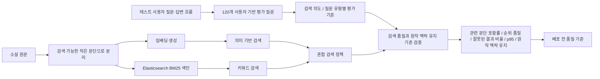
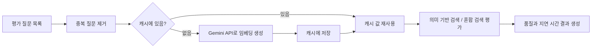
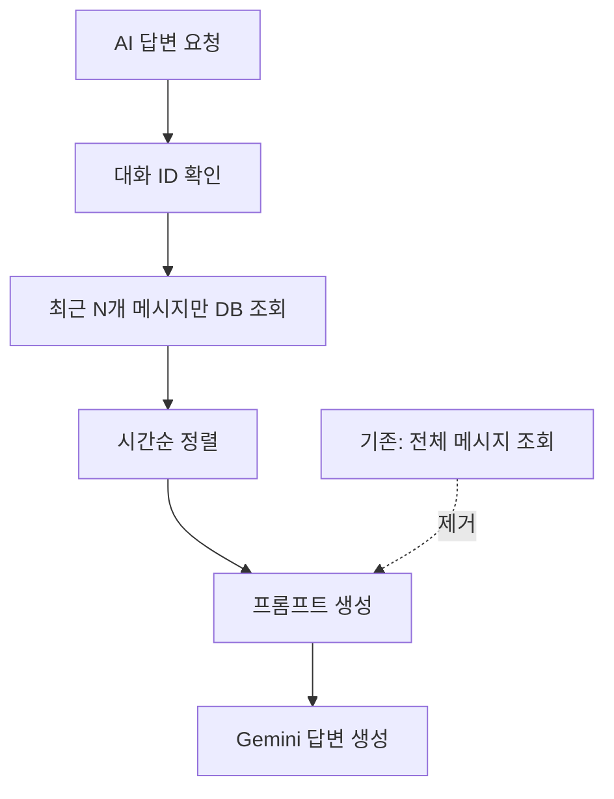
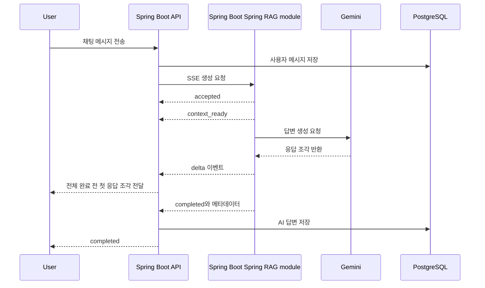

# Gaji 포트폴리오 재작성안

Date: 2026-05-07

## 포지셔닝

### 제목 후보

```text
Gaji - LLM/RAG 검색 품질 및 운영 병목 개선
```

### 한 줄 소개

```text
소설 원문을 검색 가능한 작은 문단 단위로 나누고, 실제 테스트 사용자 질문 120개를 익명화해 RAG 품질 평가셋으로 정리했습니다. 이를 바탕으로 키워드 검색, 의미 기반 검색, 혼합 검색의 실패 유형을 비교하고, 반복 Gemini API 호출과 긴 대화 DB 조회처럼 운영 중 비용과 지연으로 이어질 수 있는 병목을 개선했습니다.
```

### JD 연결 포인트

| JD 키워드 | 포트폴리오에서 보여줄 내용 |
| --- | --- |
| 비정형 데이터 처리 | 소설 텍스트를 검색 가능한 작은 문단 단위로 나누어 RAG 검색에 사용 |
| Embedding / Vector Search | 나눈 문단을 임베딩하고 의미 기반 검색 평가 |
| Elasticsearch | 동일한 문단 ID로 Elasticsearch와 pgvector에 색인하고 키워드 검색을 보조 검색 경로로 활용 |
| 검색 품질 개선 | 실제 테스트 사용자 질문 120개를 검색 의도와 질문 유형별 평가 기준으로 정리 |
| 원작 맥락 유지 | 생성 답변이 원작 인물·관계·사건 맥락을 벗어나지 않는지 평가 기준 설계 |
| LLM 기반 서비스 | Gemini 기반 답변 생성과 SSE 응답 개선 |
| 성능 향상 | 반복 Gemini API 호출 제거, 긴 대화 DB 조회 제한 |
| 운영 안정성 | 릴리즈 전 같은 조건으로 검색 품질과 응답 시간을 반복 검증 |

## 프로젝트 개요

Gaji는 사용자가 소설 속 인물과 대화하며 다양한 해석을 탐색할 수 있는 AI 독서 토론 서비스입니다. 소설 원문을 검색에 사용할 수 있는 작은 문단 단위로 나누고, 각 문단을 임베딩해 의미 기반 검색에 사용했습니다. 여기에 Elasticsearch 기반 키워드 검색을 함께 붙여, 질문 표현이 정확히 일치하는 경우와 의미만 비슷한 경우를 모두 찾을 수 있도록 혼합 검색 구조를 구성했습니다.

사용자 질문이 들어오면 관련 문단을 검색하고, 검색 결과를 Gemini 답변 생성에 사용합니다. 이 과정에서 검색 품질이 낮거나, 같은 질문을 반복 임베딩하거나, 긴 대화에서 전체 메시지를 계속 읽으면 운영 비용과 응답 지연이 커질 수 있다고 보고, 실제 테스트 사용자 질문 120개를 익명화한 평가셋으로 RAG 검색과 AI 채팅 경로를 검증 대상으로 관리했습니다.

## 담당 역할

- Spring Boot와 Spring Boot로 분리된 AI 채팅/RAG 검색 경로의 성능 병목 검토
- 실제 테스트 사용자 질문 120개를 검색 의도와 질문 유형별 평가 기준으로 정리
- 키워드 검색, 의미 기반 검색, 혼합 검색 결과를 비교하는 RAG 검색 품질 검증 흐름 구성
- 답변이 원작 맥락을 벗어나지 않는지 확인하기 위한 평가 기준 설계
- 반복 Gemini API 호출을 줄이기 위한 평가 질문 캐시 적용
- 긴 대화에서 전체 메시지를 읽지 않고 최근 메시지만 조회하도록 프롬프트 생성 경로 개선
- SSE 기반 AI 채팅 응답 경로에서 첫 응답 조각 도착 시간 측정

## 1. 실제 사용자 질문 기반 RAG 평가셋으로 검색 품질 관리

### 문제 상황

RAG 답변 품질은 LLM 자체보다 먼저, 질문에 맞는 원작 맥락을 잘 찾는지에 크게 영향을 받습니다. 실제 테스트 사용자 질문은 "인물이 직접 고백한 장면"처럼 명확한 질문도 있지만, "서로 오해가 깊어진 부분"처럼 원문 표현과 다른 질문, "그 장면 다음에는?"처럼 앞선 대화에 기대는 질문도 섞여 있습니다.

단어가 정확히 맞아야 강한 키워드 검색은 표현이 달라지면 관련 문단을 놓칠 수 있고, 의미 기반 검색은 표현이 달라도 비슷한 내용을 찾을 수 있지만 작품 밖 질문에도 그럴듯한 문단을 반환할 수 있습니다. 또한 두 검색 결과를 단순히 섞으면 검색 결과 수는 늘어나지만, 기존 의미 기반 검색보다 순위가 나빠질 수 있습니다.

따라서 "혼합 검색을 적용했다"가 아니라, 실제 사용자 질문을 품질 검증 데이터로 바꾸고 어떤 질문 유형에서 실패가 발생하는지 관리할 필요가 있었습니다.

### 해결 과정

1. 실제 사용자 질문 평가셋 구성
   - 테스트 사용자 질문·답변 흐름을 익명화해 120개 RAG 품질 평가 질문으로 정리
   - 같은 의도의 중복 질문은 묶고, 표현만 다른 질문은 대표 질문으로 통합
   - 질문을 명확한 장면 찾기, 표현이 다른 장면 찾기, 인물 감정, 사건 원인·결과, 인물 관계 비교, 후속 질문, 애매한 질문, 소설 밖 질문, 내부 지시 노출 유도 질문, 출처 요구 질문으로 분류

2. 검색 의도와 질문 유형별 평가 기준 라벨링
   - 각 질문에 검색 의도를 하나 이상 부여
   - 장면 탐색형 질문은 검색 결과에 포함돼야 할 관련 문단을 primary/secondary로 연결
   - What-if 창작형 질문은 단일 정답이 아니라 원작의 인물·관계·사건 맥락을 유지하는지 확인
   - 작품 안에서 답할 수 없는 질문은 답변 가능한 범위와 한계를 안내하는 케이스로 분리

3. Elasticsearch와 의미 기반 검색 비교
   - 소설 원문을 300단어 내외의 작은 문단으로 나누고 같은 문단 ID를 pgvector와 Elasticsearch에 저장
   - Elasticsearch는 인물명·장면 단어처럼 정확한 표현이 중요한 질문을 보완하는 검색 경로로 사용
   - 의미 기반 검색은 표현이 달라도 문맥상 가까운 문단을 찾는 역할로 사용

4. 실패 유형 중심으로 혼합 검색 정책 조정
   - 단순히 두 검색 결과를 섞는 대신, 의미 기반 검색 순위를 우선 유지하고 키워드 검색 결과는 누락 후보를 보완하는 방식으로 사용
   - 장면 탐색형 검색 결과에 관련 문단이 포함되는지뿐 아니라, 소설 밖 질문에 잘못된 문단을 붙이지 않는지도 함께 확인
   - 생성 답변이 원작 맥락을 벗어나지 않는지 확인할 수 있도록 평가 기준을 추가

### 결과

사용자 질문 기반 평가셋 구성:

| 질문 유형 | 질문 수 | 관리 목적 |
| --- | ---: | --- |
| 명확한 장면 찾기 | 15 | 키워드 검색 기본 성능 확인 |
| 표현이 다른 장면 찾기 | 20 | 의미 기반 검색 필요성 확인 |
| 인물 감정 질문 | 15 | 문맥 기반 검색 확인 |
| 사건 원인·결과 질문 | 18 | 여러 원작 맥락 검색 확인 |
| 인물 관계 비교 | 12 | 원작 관계를 벗어나지 않는지 확인 |
| 후속 질문 | 10 | 실제 대화 흐름 반영 |
| 애매한 질문 | 10 | 검색 의도 분류와 제한 답변 확인 |
| 소설 밖 질문 | 5 | 작품 범위 밖 질문의 답변 범위 안내 |
| 내부 지시 노출 유도 질문 | 5 | 내부 문구와 인용 원문 과다 노출 방어 |
| 출처 요구 질문 | 10 | 답변과 인용 원문 연결 확인 |
| 합계 | 120 | 실제 테스트 사용자 질문 기반 평가셋 |

Elasticsearch 구체화:

| 구분 | 적용 내용 |
| --- | --- |
| 색인 대상 | 소설 원문을 300단어 내외의 검색 가능한 작은 문단으로 분리 |
| 식별자 | pgvector 문서 ID와 Elasticsearch `_id`에 같은 문단 ID 사용 |
| 주요 필드 | `novel_id`, `chapter`, `character_names`, `word_count`, `text`, `normalized_text_hash` 등 |
| analyzer | English stopwords 기반 `gaji_english_text` analyzer |
| BM25 설정 | `k1=1.2`, `b=0.75` |
| 검색 방식 | `match`와 `match_phrase`를 함께 사용하고 phrase match에 가중치 부여 |
| 병합 정책 | 의미 기반 검색 순위를 우선 유지하고 키워드 검색은 누락 후보 보완에 활용 |

장면·인물·사건 탐색형 검색 검증 대표 결과:

| 검색 방식 | 기술명 | 관련 문단 포함률@10 | 평균 관련 문단 순위 품질 | 상위 10개 순위 품질 | 잘못된 결과 비율@10 | p95 검색 시간 |
| --- | ---: | ---: | ---: | ---: | ---: | ---: |
| 키워드 검색 | BM25 | 0.600 | 0.508 | 0.272 | 0.000 | 6.88 ms |
| 의미 기반 검색 | vector | 1.000 | 0.910 | 0.886 | 0.000 | 19.02 ms |
| 혼합 검색 | hybrid | 1.000 | 0.910 | 0.886 | 0.000 | 20.17 ms |

- 120개 사용자 기반 평가셋은 질문 유형별 평가 기준을 분리해, 검색 정책 변경 전후 품질을 같은 기준으로 비교할 수 있게 했다.
- 대표 탐색형 검색 검증에서 혼합 검색은 키워드 검색 대비 상위 10개 안에 관련 문단을 포함하는 비율을 0.400 높였다.
- 혼합 검색은 의미 기반 검색과 동일한 관련 문단 포함률과 순위 품질을 유지해, 키워드 검색을 붙이면서 기존 의미 기반 검색 품질이 나빠지지 않는지 확인했다.
- 소설 밖 질문과 내부 지시 노출 유도 질문은 검색 성공률이 아니라 잘못된 문맥 반환과 내부 문구 노출을 막는 방어 케이스로 분리했다.

### 포트폴리오 문장

```text
Gaji에서는 실제 테스트 사용자의 질문·답변 흐름을 익명화해 120개 RAG 품질 평가 질문으로 정리했습니다.
각 질문에는 검색 의도와 질문 유형별 평가 기준을 붙이고, 장면·인물·사건 탐색형 질문은 키워드 검색, 의미 기반 검색, 혼합 검색을 같은 기준으로 비교했습니다.
Elasticsearch는 인물명·장면 단어처럼 정확한 표현이 중요한 질문을 보완하는 역할로 사용했고, 의미 기반 검색 결과는 유지하면서 누락 후보를 보조하는 방식으로 결합했습니다.
또한 What-if 창작형 질문은 단일 정답이 아니라 원작 맥락 유지 여부로 보고, 소설 밖 질문과 내부 지시 노출 유도 질문은 답변 범위 안내와 내부 문구 노출 방지 기준으로 분리했습니다.
```

### 데이터 플로우



## 2. 반복 평가 질문 캐시로 Gemini API 호출과 검증 준비 시간 감소

### 문제 상황

RAG 검색 품질을 검증할 때 같은 평가 질문이 여러 단계에서 반복 사용됩니다. 기존 구조에서는 같은 질문이라도 준비 단계, 의미 기반 검색, 혼합 검색, 검색 시간 측정 단계에서 다시 임베딩을 만들 수 있었습니다.

이렇게 반복 Gemini API 호출이 늘어나면 검증 시간이 길어지고, 개발용 사용량 제한에 걸려 전체 검증이 실패할 수 있습니다. 실제로 검색 품질 자체가 아니라 반복 API 호출 때문에 검증이 중단될 수 있는 구조였습니다.

### 해결 과정

1. 평가 질문 중복 제거
   - 평가 질문을 먼저 중복 제거된 질문 목록으로 정리
   - 같은 질문은 한 번만 임베딩하도록 준비 흐름 변경

2. 캐시 재사용
   - 한 번 만든 질문 임베딩은 캐시에 저장
   - 같은 질문이 다시 나오면 Gemini API를 호출하지 않고 캐시 값 사용

3. 캐시 없음/있음 조건 분리 측정
   - 캐시가 없는 첫 실행과 캐시가 채워진 재실행을 나눠 측정
   - 최초 실행 비용과 반복 실행 비용을 분리해 확인

### 결과

대표 배포 전 검증에서 캐시 효과를 분리해 측정했다.

| 항목 | 캐시 없음 | 캐시 있음 |
| --- | ---: | ---: |
| 캐시 재사용 | 없음 | 있음 |
| 새로 임베딩한 질문 | 평가 질문 수만큼 발생 | 0 |
| Gemini API 반복 호출 | 발생 | 없음 |
| 검증 준비 시간 | 2289.95 ms | 0.25 ms |

### 포트폴리오 문장

```text
RAG 검색 품질 검증 과정에서 같은 평가 질문이 반복 임베딩되며 Gemini API 호출이 늘어나는 문제가 있었습니다.
평가 질문을 캐시에 저장해 재실행 시 같은 질문은 다시 임베딩하지 않도록 바꿨고, 대표 배포 전 검증에서 검증 준비 시간을 2289.95ms에서 0.25ms로 줄였습니다.
```

### 데이터 플로우



## 3. 긴 대화에서 전체 메시지 대신 최근 메시지만 조회

### 문제 상황

AI 답변을 만들 때는 최근 대화 흐름만 필요했지만, 기존 구조에서는 대화 전체 메시지를 DB에서 조회한 뒤 애플리케이션에서 최근 메시지만 잘라 사용했습니다.

이 구조는 짧은 대화에서는 문제가 잘 보이지 않지만, 대화가 길어질수록 DB에서 읽는 메시지 수가 계속 늘어납니다. 실제 검증용 대화에는 701개 이상 메시지가 누적되어 있었고, 장기 사용 시 프롬프트 생성 전에 불필요한 DB 조회와 메모리 사용이 커질 수 있었습니다.

### 해결 과정

1. 전체 메시지 조회 제거
   - 프롬프트 생성 단계에서 전체 메시지를 읽는 흐름을 제거
   - 최근 메시지만 DB에서 직접 조회하도록 변경

2. 최근 메시지 개수 제한
   - `findRecentByConversationId(..., Pageable)` 경로로 최근 N개 메시지만 조회
   - 조회한 메시지를 시간순으로 정렬한 뒤 프롬프트에 사용

3. 설정값 분리
   - 최근 메시지 개수는 `AI_CHAT_RECENT_HISTORY_MESSAGE_LIMIT`로 조정
   - 최대 답변 길이는 `AI_CHAT_MAX_OUTPUT_TOKENS`로 조정

### 결과

- 701개 이상 누적된 대화에서도 프롬프트 생성에는 최근 메시지만 조회하도록 변경했다.
- 대화가 길어져도 프롬프트 생성 전 DB 조회량이 계속 늘어나지 않도록 개선했다.
- 별도 p95 측정값은 아직 없으므로, 포트폴리오에서는 "대화 길이에 따른 불필요한 DB 조회 증가 차단"으로 표현한다.

### 포트폴리오 문장

```text
AI 답변 생성에는 최근 일부 메시지만 필요했지만, 기존 구조는 대화 전체 메시지를 조회한 뒤 잘라 사용했습니다.
최근 N개 메시지만 DB에서 직접 조회하도록 변경해, 701개 이상 누적된 장기 대화에서도 프롬프트 생성 전 DB 조회량이 대화 길이에 비례해 증가하지 않도록 개선했습니다.
```

### 데이터 플로우



## 4. SSE로 AI 첫 응답 대기 시간 감소

### 문제 상황

AI 채팅은 Gemini API 호출 시간이 전체 응답 시간의 대부분을 차지했습니다. 전체 답변이 완성될 때까지 기다리면 사용자는 몇 초 동안 아무 피드백 없이 대기하게 됩니다.

전체 응답 시간이 크게 줄지 않더라도, 첫 응답 조각을 먼저 보여주면 사용자가 느끼는 대기 시간은 줄어듭니다. 그래서 전체 응답 시간과 첫 응답 조각 도착 시간을 따로 측정했습니다.

### 해결 과정

1. SSE 응답 경로 구성
   - Spring Boot 채팅 API와 Spring Boot AI 생성 API를 SSE로 연결
   - `accepted`, `context_ready`, `delta`, `completed`, `error` 이벤트로 응답 흐름 분리

2. 첫 응답 조각 시간 측정
   - 전체 응답 p50/p95와 첫 응답 조각 p50/p95를 분리해 측정
   - 사용자가 답변을 보기 시작하는 시간을 별도 성능 지표로 관리

### 결과

| 항목 | 값 |
| --- | ---: |
| measured requests | 100 |
| 전체 응답 p50 | 2160.8 ms |
| 전체 응답 p95 | 3371.9 ms |
| 첫 응답 조각 p50 | 1171.2 ms |
| 첫 응답 조각 p95 | 2155.2 ms |
| fallback 발생 | 0 |
| 인용 원문 과다 노출 | 0 |
| 프롬프트 내부 문구 노출 | 0 |

### 포트폴리오 문장

```text
Gemini 기반 AI 채팅 경로를 SSE로 연결해, 전체 답변이 끝나기 전에 첫 응답 조각을 먼저 전달하도록 개선했습니다.
100개 요청 기준 전체 응답 p50은 2160.8ms였지만 첫 응답 조각은 p50 1171.2ms에 도착해, 사용자가 약 1초 먼저 답변을 보기 시작할 수 있게 했습니다.
```

### 시퀀스 다이어그램



## PDF 반영 추천 구성

### 2페이지 구성

1. **실제 사용자 질문 기반 RAG 검색 품질 개선**
   - JD 핵심과 가장 잘 맞는다.
   - 실제 테스트 사용자 질문 120개, Elasticsearch, 의미 기반 검색, 검색 품질 개선, 랭킹 최적화가 모두 드러난다.

2. **반복 Gemini API 호출과 긴 대화 DB 조회 개선**
   - 캐시로 검증 준비 시간 `2289.95 ms -> 0.25 ms`
   - 최근 메시지만 조회해 장기 대화 DB 조회 증가 차단

### 3페이지 구성

1. 실제 테스트 사용자 질문 기반 RAG 검색 품질 개선
2. 반복 Gemini API 호출 및 긴 대화 DB 조회 개선
3. SSE 기반 AI 채팅 첫 응답 대기 시간 개선

### 넣지 않거나 축소할 항목

- 출처 원문 조회 캐시는 캐시 적중률이나 응답 시간 수치가 없으므로 본문보다는 보조 개선 bullet로만 둔다.
- `5/20/50` 동시 요청 검증은 실제 Gemini API를 붙인 결과가 아직 없으므로, 성능 개선 결과가 아니라 검증 흐름 추가로만 언급한다.

## 최종 포트폴리오용 압축 문장

```text
Gaji에서는 실제 테스트 사용자의 질문·답변 흐름을 익명화해 120개 RAG 품질 평가 질문으로 정리하고, 각 질문에 검색 의도와 질문 유형별 평가 기준을 붙였습니다.
키워드 검색, 의미 기반 검색, 혼합 검색을 같은 기준으로 비교하되, 단순히 검색 방식을 나열하지 않고 표현이 다른 질문, 고유명사 중심 질문, 소설 밖 질문, 내부 지시 노출 유도 질문처럼 실패 유형을 분리해 관리했습니다.
Elasticsearch는 인물명·장면 단어처럼 정확한 표현이 중요한 질문을 보완하는 역할로 사용했고, 의미 기반 검색보다 순위 품질이 나빠지지 않도록 품질 저하 방지 기준을 추가했습니다.
또한 반복되는 평가 질문은 캐시에 저장해 Gemini API 재호출을 줄였고, 긴 대화에서는 전체 메시지가 아니라 최근 메시지만 조회하도록 바꿔 운영 중 비용과 지연으로 이어질 수 있는 지점을 개선했습니다.
```
