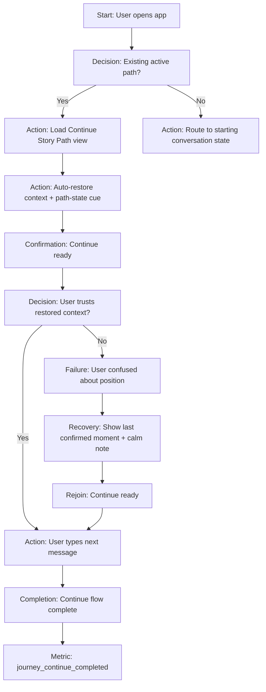
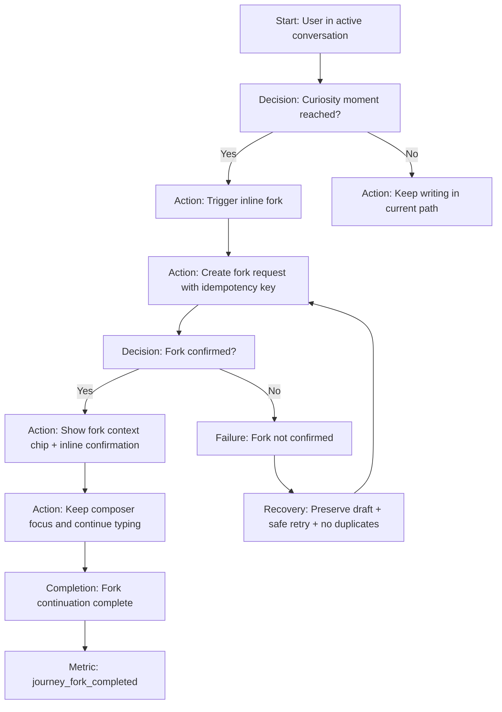
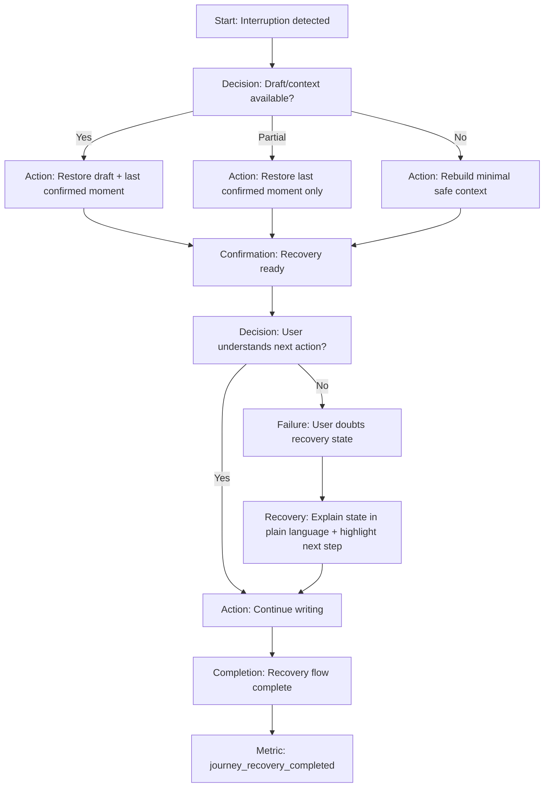

---
stepsCompleted:
  - 1
  - 2
  - 3
  - 4
  - 5
  - 6
  - 7
  - 8
  - 9
  - 10
  - 11
  - 12
  - 13
  - 14
inputDocuments:
  - /Users/yeongjae/gaji/docs/specs/mvp-v2/product-brief-gaji-2026-02-25.md
lastStep: 14
workflow_completed: true
workflow_completed_at: 2026-02-26
---

# UX Design Specification gaji

**Author:** yeongjae
**Date:** 2026-02-25T11:53:56Z

---

<!-- UX design content will be appended sequentially through collaborative workflow steps -->

## Executive Summary

### Project Vision

gaji aims to build a continuity-first language learning experience for grade 5-6 and middle-school learners by making story progression the core interaction model, not assignment completion. The UX must consistently reinforce "continue my story" as the primary habit-forming action while still enabling controlled exploration through branching.

### Target Users

Primary users are grade 5-6 learners seeking short, guided, mobile-friendly sessions and middle-school learners seeking deeper, autonomy-driven narrative sessions. Secondary users are parents who evaluate trust and educational value through concise, understandable weekly engagement signals.

### Key Design Challenges

- Preserve continuity priority without suppressing novelty and exploration behavior.
- Guarantee deterministic resume behavior across devices and concurrent usage conditions.
- Enforce branch constraints (max 3 top branches) without confusing users.
- Maintain KPI integrity by separating intentional user actions from system-triggered behavior.
- Communicate safety interventions in audience-appropriate tone (supportive for learners, clear/auditable for parents).

### Design Opportunities

- Define explicit interaction hierarchy: Continue Story Path > Try Another Story Path > Explore New.
- Split user intents into two fast paths: Quick Resume vs Deep Explore.
- Deliver one-glance parent trust card with stable, plain-language weekly metrics.
- Use behavior-first launch quality gates (resume determinism, branch integrity, event integrity) to protect trust during UI transformation rollout.

## Core User Experience

### Defining Experience

The core gaji experience is continuity-first story conversation: users return to Continue Story Path by default, then create "what if" forks after a short conversation when curiosity emerges. The interaction should preserve narrative coherence while making branching feel like natural continuation, not a mode switch.

### Platform Strategy

MVP priority is desktop web with keyboard-first interaction. The frontend follows Next.js domain structure, and browser requests go through `/api/*` gateway boundaries. Offline support is out of scope for MVP.

### Effortless Interactions

- Continue Story Path is always the dominant return action.
- Fork is triggered inline near the current meaningful turn.
- After fork creation, keyboard focus remains in the composer and scroll position is preserved.
- Resume lands on the last active exchange with composer ready.
- Path context updates are subtle and non-disruptive.
- Context restoration is automatic for base path and fork transitions.
- User-facing copy stays simple while internal fork eligibility and validation remain tunable.

### Critical Success Moments

- User returns and sees immediate continuity: "Your story is right where you left it."
- User creates a fork after a few turns and continues writing without interruption.
- User perceives creative freedom with coherent narrative state.

Critical failure moments:
- Lost or inconsistent context between base path and fork.
- Duplicate or failed fork creation under rapid repeated input.
- Boundary friction (gateway/auth/failure flows) that breaks writing rhythm.

Fallback behavior expectations:
- Low-confidence restore moves to the last confirmed canonical moment with clear non-technical notice.
- Fork timeout/failure preserves draft, allows safe retry, and prevents duplicates via idempotent action handling.
- Session refresh path recovers writing state and draft text after re-auth.

### Experience Principles

- Continuity by Default
- Curiosity-Moment Forking
- Desktop Keyboard Velocity
- Invisible Boundaries
- Creative Freedom with Controlled Reliability
- Graceful Degradation with Canonical State Preservation

Creative freedom is a UX promise, while controlled reliability is a system guarantee. Users should feel uninterrupted writing flow even during recovery paths.

MVP prioritizes rapid iteration, but never below the continuity trust floor. The release must guarantee canonical resume integrity, idempotent fork creation, and draft preservation through retries or recovery flows.

## Desired Emotional Response

### Primary Emotional Goals

- Primary: Empowered narrative control with safe, uninterrupted creative momentum.
- Secondary: Calm confidence on resume, curiosity during branching, trust during recovery.
- Differentiator: "My story continues reliably, and I can explore alternatives without losing control."

### Emotional Journey Mapping

- Discovery: meaningful and inviting, not assignment pressure.
- First interaction: immediate flow and orientation.
- Resume: certainty and momentum.
- Fork: authorship and agency without friction.
- Recovery/Fallback: reassurance, clarity, and continued progress.
- Return use: anticipation and trust in continuity.

### Micro-Emotions

- Maximize: confidence, curiosity, trust, accomplishment, focus.
- Minimize: confusion, anxiety, loss of control, frustration, skepticism.
- Critical transitions:
  - uncertainty -> certainty (resume)
  - hesitation -> agency (fork)
  - alarm -> reassurance (recovery)

### Design Implications

- Confidence -> deterministic resume target and immediate context restoration.
- Agency -> inline fork affordance at the curiosity moment, with no heavy mode shift.
- Trust -> calm, non-technical fallback messaging with consistent outcomes.
- Accomplishment -> explicit fork-created confirmation and immediate writable state.
- Focus -> preserve composer focus, scroll position, and draft through retries/re-auth.
- Parent trust lens -> stable, understandable emotional semantics for safety/progress signals.

### Emotional Design Principles

- Keep users in narrative flow, including recovery moments.
- Make recovery feel like continuation, not failure handling.
- Reward creative intent immediately with clear state feedback.
- Use plain, calm language; avoid technical leakage.
- Preserve emotional freedom through reliable, invisible system guarantees.
- Design emotional outcomes per state and per audience (learner vs parent).

State tone system:
- Resume: calm-certainty
- Fork: energized-agency
- Recovery: steady-reassurance

Recovery clarity heuristic:
- Users should understand what happened and the next action in one glance.

Emotion-to-artifact mapping:
- Resume certainty -> return card and primary CTA hierarchy.
- Fork agency -> inline fork trigger and immediate confirmation.
- Recovery reassurance -> inline notice and one clear next action.

Ownership boundaries:
- Product owns emotional intent.
- Design owns tone system and microcopy brevity.
- Engineering owns state fidelity and recovery consistency.

## UX Pattern Analysis & Inspiration

### Inspiring Products Analysis

Primary inspiration source: Character.ai (deep analysis).

Character.ai demonstrates high-retention conversation UX through low-friction entry, writing-centered interaction, and strong character identity consistency. Users can quickly enter conversation without heavy setup, and the interface keeps attention on composition and response flow.

The product solves "start talking now" elegantly by minimizing non-essential decisions before interaction. Its strongest engagement loop comes from immediate conversational immersion and identity continuity at the character layer.

### Transferable UX Patterns

Adopt directly:
- Fast re-entry to active conversation with minimal startup friction.
- Writing-first interface hierarchy (composer and latest exchange as primary focus).
- Consistent character identity cues to sustain narrative immersion.

Adapt for gaji (not copy as-is):
- Add continuity-first resume semantics with explicit "continue where you left off" behavior.
- Add intentional fork semantics tied to curiosity moments within conversation flow.
- Add calm, trust-preserving recovery behavior when continuity confidence is low.
- Keep Character.ai interaction rhythm, but apply gaji continuity semantics and state integrity rules.

Path-state visibility requirements:
- Always show whether user is in base path or fork path with low cognitive load.
- Branch-state recognition should be one-glance on return.
- Use persistent, lightweight path indicators that do not interrupt writing flow.

### Anti-Patterns to Avoid

- Session discontinuity that causes context loss between visits.
- Hidden or ambiguous branch/fork state that makes users unsure where they are.
- Technical/system-jargon error messages that break emotional flow and trust.
- Recovery flows that feel like failure handling instead of narrative continuation.
- Copying external state models directly without gaji continuity guarantees.

### Design Inspiration Strategy

What to adopt:
- Character.ai-style low-friction conversational entry.
- Writing-rhythm-preserving interaction hierarchy.

What to adapt:
- Convert immersion UX into a continuity-governed model with explicit resume/fork state integrity.
- Layer parent-trust-compatible emotional semantics on top of learner-facing conversational flow.

What to avoid:
- Any UX behavior that weakens continuity confidence or branch clarity.
- Any fallback copy that exposes technical internals to users.

Decision rule:
- Copy interaction feel, not state model.

Design mantra:
- Keep the magic, show the map.

gaji strategic position:
- Combine Character.ai-level conversational immersion with reliable continuity and intentional fork management that users can trust across repeated sessions.

## Design System Foundation

### 1.1 Design System Choice

Themeable design system approach using Park UI + PandaCSS as the base foundation, extended with project-specific design tokens and selective custom components.

### Rationale for Selection

- Balances development speed and UX differentiation for current MVP phase.
- Aligns with existing modernization direction and frontend standards in project context.
- Preserves flexibility for continuity-first conversational UX and fork-state clarity without full custom-system overhead.
- Reduces integration and maintenance risk compared with fully custom design system development.

### Implementation Approach

- Adopt Park UI primitives/components as the default baseline.
- Use PandaCSS for tokenized styling, composition patterns, and scalable theming.
- Define a token model for typography, spacing, semantic colors, interaction states, and path-state indicators.
- Keep component architecture writing-flow-first and desktop keyboard-first.

### Customization Strategy

- Keep standard components from the base system where possible.
- Build selective custom components only for continuity-critical interactions:
  - Resume card (continue-story primary entry)
  - Base-path vs fork-path persistent indicator
  - Inline fork trigger in conversation flow
- Apply strict design-token governance so custom and base components remain visually and behaviorally consistent.
- Reassess deeper custom-system expansion only after KPI validation and UX stability.

Token governance and quality gates:
- Token versioning and change-control policy required for all token changes.
- Quality gates include token consistency checks, accessibility baseline checks, and visual regression checks for continuity-critical components.

MVP customization boundary:
- Do customize continuity-critical surfaces only.
- Do not customize generic controls/layout primitives unless they block core UX goals.
- All custom components must inherit base typography/spacing/semantic tokens.

Decision review triggers:
- Re-open design system decision only when measurable evidence indicates mismatch.
- Technical triggers: repeated visual regression failures on custom components or accessibility regressions across two releases.
- UX triggers: measurable degradation in resume/fork clarity in usability or product-quality checks.

## 2. Core User Experience

### 2.1 Defining Experience

Pick up your story instantly, then branch your curiosity without losing flow.

gaji's defining interaction combines immediate continuity resume with in-context what-if branching, so users can keep narrative momentum while exploring alternatives naturally.

### 2.2 User Mental Model

Users think in conversation terms, not workflow terms:
- "I come back and continue where I left off."
- "If I'm curious, I branch from this exact moment."
- "I should never lose my writing context."

This builds on familiar chat expectations but adds explicit continuity and branch-state awareness unique to gaji.

### 2.3 Success Criteria

Top success indicators:
- One-glance resume clarity on return.
- One-action fork from current meaningful turn.
- Keyboard writing flow remains uninterrupted during resume/fork/recovery.

Supporting indicators:
- Time-to-first-meaningful-action after return remains low and stable.
- Base-path vs fork-path state is always legible.
- Recovery preserves draft/context and keeps users in writing flow.
- Users can continue writing immediately after resume/fork confirmation.

### 2.4 Novel UX Patterns

Pattern type: familiar conversation UX with a novel continuity-plus-fork twist.

Established patterns:
- Message-first interaction
- Composer-centric layout
- Conversational turn rhythm

Novel gaji extensions:
- Deterministic continuity resume semantics
- Explicit base/fork path visibility
- Curiosity-moment inline fork mechanism with trust-preserving fallback
- Persistent fork-context chip near composer after path switch

### 2.5 Experience Mechanics

1. Initiation
- User returns to the conversation surface.
- Continue Story Path is primary and immediately actionable.
- System auto-restores context and auto-updates path-state indicator.

2. Interaction
- User writes in keyboard-first flow.
- User can trigger fork inline at the current turn with one action.
- System confirms new path while preserving composer focus and scroll continuity.
- Fork creation is idempotent under repeated trigger attempts (no duplicate visible outcomes).

3. Feedback
- Clear state cues show base vs fork context.
- Non-blocking confirmation pattern: context chip plus inline confirmation text, no modal interruption.
- Success feedback confirms resume/fork readiness to continue writing.
- If recovery is needed, system provides calm, non-technical guidance and keeps draft safe.
- User-facing rule: path changes only after system confirmation.

4. Completion
- User sends next message in the resumed or newly forked path without friction.
- Canonical state commits only on confirmed successful action completion.
- System preserves continuity state for the next return.

## Visual Design Foundation

### Color System

Brand source status:
- Existing brand guidelines acknowledged by stakeholder.
- Source values not provided yet; all unresolved values remain `TBD from Brand Source`.

Semantic token structure (placeholder-ready):
- `color.primary`: `TBD from Brand Source` (intent: confidence + momentum)
- `color.secondary`: `TBD from Brand Source` (intent: support + progression)
- `color.background`: `TBD from Brand Source` (intent: calm reading surface)
- `color.surface`: `TBD from Brand Source` (intent: layered clarity without noise)
- `color.text.primary`: `TBD from Brand Source` (intent: high readability)
- `color.text.secondary`: `TBD from Brand Source` (intent: hierarchy + reduced emphasis)
- `color.success`: `TBD from Brand Source` (intent: safe completion feedback)
- `color.warning`: `TBD from Brand Source` (intent: gentle attention without panic)
- `color.error`: `TBD from Brand Source` (intent: clear recovery guidance)
- `color.path.base`: `TBD from Brand Source` (intent: stable continuity state)
- `color.path.fork`: `TBD from Brand Source` (intent: active branching context)

Mapping policy:
- Map finalized brand colors into PandaCSS semantic tokens and Park UI theme slots.
- Keep state colors aligned with emotional tone system (resume calm-certainty, fork energized-agency, recovery steady-reassurance).

### Typography System

Brand font status:
- Heading and body fonts: `TBD from Brand Source`.

Token structure:
- `font.heading`: `TBD from Brand Source` (intent: confident narrative framing)
- `font.body`: `TBD from Brand Source` (intent: long-form readability for chat)
- `font.mono`: system fallback for technical/debug contexts only

Type hierarchy strategy:
- Keyboard-first conversation readability prioritized over decorative display styling.
- Distinct hierarchy for: page title, conversation context labels, message content, helper feedback.
- All final values to be integrated through tokenized scale in PandaCSS.

### Spacing & Layout Foundation

Base spacing unit:
- `space.base`: `TBD from Brand Source`.

Layout strategy:
- Desktop web, keyboard-first density with writing-flow priority.
- Composer and latest exchange remain primary visual anchors.
- Persistent path-state indicator stays visible with low cognitive load.
- Non-blocking inline confirmations preferred over modal interruptions.

Spacing token placeholders:
- `space.xs`, `space.sm`, `space.md`, `space.lg`, `space.xl`: `TBD from Brand Source`

Grid and rhythm:
- Use a consistent token-based spacing rhythm across standard and custom components.
- Custom continuity-critical components must inherit base typography and spacing tokens.

### Accessibility Considerations

Placeholder replacement acceptance rules:
- No placeholder value is accepted as final until accessibility validation passes.
- Validate text/background contrast for all semantic roles and state colors.
- Validate legibility for conversation-heavy reading and keyboard-focus states.

Guardrails:
- Do not expose unresolved placeholder values as production-ready decisions.
- Keep unresolved fields explicitly marked `TBD from Brand Source`.
- Apply design-system quality gates (token consistency, accessibility baseline, visual regression) before final lock.

## Design Direction Decision

### Design Directions Explored

8 visual directions were explored in `/Users/yeongjae/gaji/docs/specs/mvp-v2/ux-design-directions.html` across:
- layout split vs chat-first emphasis
- medium vs dense visual weight
- explicit vs subtle path-state presentation
- continuity guidance intensity
- fork affordance prominence
- reliability/status cue strength
- calm-reading tone
- adaptive shell behavior

### Chosen Direction

Chosen direction is a composite:
- Base: Direction 01 (Balanced Workspace)
- Additions: reliability/status cues from Direction 05
- Additions: calm recovery tone from Direction 07
- Constraint: keep adaptive behavior from Direction 08 subtle and non-blocking

Locked hierarchy order:
1. Continue Story Path
2. Path-state cue (base/fork visibility)
3. Fork action

Fallback rule:
- If adaptive cue layer fails, UI deterministically degrades to Direction 01 baseline while preserving the same hierarchy order.

### Design Rationale

- Optimizes comprehension-first onboarding while preserving creator-side branching depth.
- Best supports continuity-first writing flow without overloading users with branch controls.
- Keeps path state legible and trustworthy in both normal and degraded states.
- Aligns with design-system constraints (Park UI + PandaCSS + selective custom components) with lower implementation risk.

### Implementation Approach

- Implement Direction 01 layout shell as the default production baseline.
- Layer Direction 05 reliability cues as lightweight, persistent status feedback.
- Apply Direction 07 calm recovery tone in fallback and recovery copy/states.
- Add subtle adaptive hints inspired by Direction 08 only where they do not interrupt composer flow.
- Treat visual regressions affecting locked hierarchy as release blockers.
- Validate fallback-to-baseline behavior in rollout and QA gates.

## User Journey Flows

Cross-journey invariant:
- Canonical conversation state must remain consistent across continue, fork, and recovery flows.

### Journey 1: Return & Continue Story Path

Goal:
- Help user re-enter story with one-glance clarity and immediate writing readiness.

Completion event:
- `journey_continue_completed`

Trust touchpoint:
- User sees clear confirmation that story context is restored to the expected point.

Cognitive-load checkpoint:
- Return screen must make next action obvious in one glance.

Drop-off risk node:
- "I am not sure if this is the same story point."

### Journey 2: In-Context Fork Creation & Branch Continuation

Goal:
- Let user create a fork from the current turn in one action and continue writing in that fork.

Completion event:
- `journey_fork_completed`

Trust touchpoint:
- User receives explicit base/fork context confirmation right after fork creation.

Cognitive-load checkpoint:
- Fork action and resulting path context should be understandable instantly.

Drop-off risk node:
- "Did I actually switch to a new branch?"

### Journey 3: Recovery & Safe Resume After Interruption/Error

Goal:
- Preserve user momentum when interruptions happen and safely resume at a confirmed moment.

Completion event:
- `journey_recovery_completed`

Trust touchpoint:
- Recovery message is calm, non-technical, and confirms safe continuity.

Cognitive-load checkpoint:
- Recovery state must provide one clear next action.

Drop-off risk node:
- "I think my recent writing is lost."

### Journey Patterns

Navigation patterns:
- Continue-first entry with persistent path-state indicator.
- Single primary action hierarchy: Continue -> Path-state -> Fork.

Decision patterns:
- Standard node progression: Start -> Decision -> Action -> Confirmation -> Completion.
- Standard error progression: Failure -> Recovery -> Rejoin.

Feedback patterns:
- Non-blocking inline confirmations over modal interruptions.
- Calm recovery messaging with one clear next step.

### Flow Optimization Principles

- Minimize steps to first meaningful action after return.
- Keep fork creation one-action and idempotent under repeat input.
- Preserve composer focus and draft continuity across all journeys.
- Treat branch-state legibility as both UX and reliability requirement.
- Use one-glance checkpoints to reduce cognitive load in critical moments.

## Component Strategy

### Design System Components

Design-system coverage (Park UI + PandaCSS):
- Use Park/Panda primitives for generic controls and layout:
  - Buttons, inputs, text fields, badges/chips
  - Cards, panels, grid/layout primitives
  - Typography, spacing, semantic token utilities
  - Inline alert/toast-like feedback primitives
- Keep all component styling token-driven through PandaCSS.

Gap analysis (continuity-specific needs not fully covered by base system):
- Resume Card (continue-first return context)
- Base/Fork Path Indicator (persistent path-state clarity)
- Inline Fork Trigger (one-action branch creation in conversation flow)

### Custom Components

#### Resume Card (MVP Must-Have)

**Purpose:** Provide one-glance return clarity with primary Continue action.  
**Usage:** Entry point for return flow before conversation resume.  
**Anatomy:** Path title, last confirmed moment summary, primary Continue CTA, secondary context hint.  
**States:** default, loading, restored, low-confidence fallback, error-retry.  
**Variants:** compact (dashboard), expanded (conversation entry).  
**Accessibility:** keyboard-first focus order; clear CTA label; status messaging for restore state.  
**Interaction Behavior:** Continue remains visually primary and non-ambiguous.  
**Stable Contract:** Emits stable props/events for analytics and fallback logic decoupling.  
**Metric Traceability:** Supports `journey_continue_completed`.  
**Anti-Pattern:** Do not add competing secondary CTAs that visually outrank Continue.

#### Base/Fork Path Indicator (MVP Must-Have)

**Purpose:** Persistently show active conversation context (base vs fork).  
**Usage:** Header and near composer for continuous state awareness.  
**Anatomy:** Context chip, path label, optional lightweight confirmation text.  
**States:** base, fork, switching, confirmed, degraded fallback.  
**Variants:** header-inline, composer-inline.  
**Accessibility:** non-color state cue support; screen-reader-friendly state text.  
**Interaction Behavior:** Always contextual; never visually outranks Resume action.  
**Stable Contract:** Stable state/value props + change events.  
**Metric Traceability:** Supports interpretation for `journey_continue_completed` and `journey_fork_completed`.  
**Anti-Pattern:** Do not hide path context behind extra clicks in core flows.

#### Inline Fork Trigger (MVP Must-Have)

**Purpose:** Enable one-action fork creation at curiosity moments without breaking writing flow.  
**Usage:** Conversation turn area and composer-level quick action.  
**Anatomy:** Fork action control, lightweight confirmation feedback, retry affordance.  
**States:** idle, submitting, confirmed, failed-retry, idempotent-repeat handled.  
**Variants:** turn-level trigger, composer-level quick fork.  
**Accessibility:** keyboard activation support; explicit action naming; retry clarity.  
**Interaction Behavior:** idempotent under repeated inputs; preserve draft/focus/scroll.  
**Stable Contract:** Stable action/result events for analytics and QA automation.  
**Metric Traceability:** Supports `journey_fork_completed`.  
**Anti-Pattern:** Do not require modal-heavy multi-step fork setup in primary flow.

#### Adaptive Hint Layer (Post-MVP Enhancement)

**Purpose:** Subtle adaptive hints based on intent while preserving baseline direction integrity.  
**Usage:** Optional enhancement over Direction 01 baseline.  
**Constraint:** If adaptive cues fail, deterministically degrade to baseline without hierarchy shift.  
**Metric Traceability:** Supports behavioral interpretation quality, not core completion KPIs.  
**Anti-Pattern:** Do not let adaptive hints alter primary hierarchy or block composer flow.

### Component Implementation Strategy

- Foundation-first: default to design-system primitives unless continuity-critical need exists.
- Visual precedence invariant: `Resume > Path Indicator > Fork`.
- Fallback invariant: adaptive-layer failures degrade to baseline layout and preserve hierarchy.
- State matrix rule: each custom component must cover minimum states:
  - default
  - loading/submitting
  - success/confirmed
  - failure
  - retry/recovery
- Accessibility-first implementation:
  - semantic HTML first
  - ARIA only where native semantics are insufficient
  - keyboard and focus behavior validated in custom components
- Quality gates:
  - token consistency checks
  - accessibility baseline checks
  - visual regression checks for continuity-critical surfaces

### Implementation Roadmap

**Phase 1 - Core continuity components (MVP):**
- Resume Card
- Base/Fork Path Indicator

**Phase 2 - Branching interaction (MVP):**
- Inline Fork Trigger
- Retry/recovery behavior states for fork/continue surfaces

**Phase 3 - Enhancement components (Post-MVP):**
- Adaptive hint layer
- Additional instrumentation and UX optimizations after KPI validation

## UX Consistency Patterns

### Button Hierarchy

- Primary action: `Continue Story Path`
- Contextual cue (non-primary action role): `Path-state indicator` (base/fork visibility)
- Secondary action: `Fork` (Try Another Path)
- Destructive/deferred actions: visually de-emphasized; never adjacent to primary action without spacing separation.
- Consistency rule: hierarchy order must remain stable across states and breakpoints.

### Feedback Patterns

- Prefer inline, non-blocking confirmations over modal interruptions.
- Recovery messaging tone: calm, non-technical, action-oriented.
- Never expose technical internals in user-facing feedback copy.
- Trust-touchpoint rule: every critical journey includes explicit confirmation of safe state.

### Form Patterns

- Composer behavior is keyboard-first by default.
- Validation supports recoverable retry without draft loss.
- Submission errors preserve user input and show one clear next action.
- Focus management must return to intended typing context after recoverable states.

### Navigation Patterns

- Continue-first entry pattern for return flows.
- Persistent low-cognitive path-state visibility (base/fork) in conversation context.
- Adaptive cues are optional and must remain subtle/non-blocking.
- If adaptive cue layer fails, fallback to baseline direction deterministically.

### Additional Patterns

**Loading / Empty States**
- Loading screens must preserve orientation and show next likely action.
- Empty states must provide guided continuation affordance (not dead-end messaging).
- One-glance action clarity required at all key checkpoints.

**Modal / Overlay Usage**
- Use only when truly blocking confirmation is necessary.
- Core continue/fork/recovery flows should avoid modal dependence.

## Responsive Design & Accessibility

### Responsive Strategy

- Strategy: desktop-first adaptive.
- Preserve keyboard-first writing flow as primary desktop behavior.
- Controlled collapse for tablet/mobile while preserving action hierarchy and continuity cues.
- Keep path-state context visible across device adaptations.

### Breakpoint Strategy

- Baseline ranges:
  - Mobile: 320px-767px
  - Tablet: 768px-1023px
  - Desktop: 1024px+
- Use these as standard breakpoints, tuned only where journey-critical behavior requires.
- Maintain invariant hierarchy across breakpoints: `Continue > Path-state > Fork`.

### Accessibility Strategy

- Target compliance: WCAG 2.2 AA (or nearest applicable AA baseline in implementation tooling).
- Accessibility requirements:
  - contrast compliance for text/state indicators
  - visible focus indicators
  - full keyboard navigation in core flows
  - screen reader compatibility for dynamic state cues
  - touch targets minimum 44x44px where touch interactions exist

### Testing Strategy

**Responsive testing**
- representative desktop/tablet/mobile viewport testing
- cross-browser checks (Chrome, Firefox, Safari, Edge)
- real-device checks for key journey touchpoints

**Accessibility testing**
- automated a11y scanning + manual validation
- keyboard-only navigation pass
- screen-reader sanity checks for core journeys
- contrast and focus-visibility verification

**Acceptance checks**
- hierarchy invariant preserved across breakpoints
- no continuity-critical regression in return/fork/recovery flows

### Implementation Guidelines

- Semantic HTML first; avoid ARIA overuse.
- ARIA used only where native semantics cannot express required meaning.
- Use tokenized spacing/typography/color values exclusively (no ad hoc drift).
- Preserve composer focus/draft continuity in recoverable failures.
- Keep feedback concise, non-technical, and consistent with emotional tone system.
