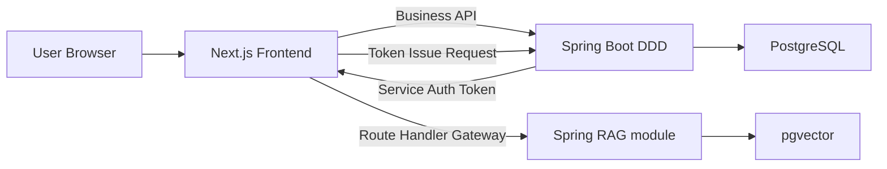
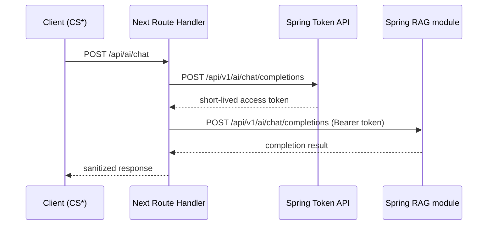

# Gaji Architecture (Session-Aligned)

**Version:** 2.0  
**Date:** 2026-02-16  
**Status:** Target Architecture

## 1. Architecture Goal

This architecture defines the target system after modernization:

1. Spring backend refactored to DDD modular monolith.
2. Frontend migrated from Vue 3 SPA to Next.js App Router.
3. AI request path changed from `FE -> BE -> AI` to secure direct pattern with server gateway boundaries.

## 2. Current vs Target

### Current

1. Backend structure is mostly layer/type based (`controller/service/dto/entity/mapper`).
2. Frontend is Vue 3 + Vite SPA.
3. AI path is proxy-centric through backend.

### Target

1. Backend is bounded-context driven DDD.
2. Frontend is domain-based Next.js with `SS/CS` split.
3. Browser requests go through Next.js route handlers for gateway behavior.
4. AI access uses short-lived token issued by Spring.

## 3. Target System Context



## 4. Spring DDD Architecture

## 4.1 Bounded Contexts

1. `identity-access`
2. `catalog`
3. `scenario`
4. `conversation`
5. `social`
6. `search-discovery`
7. `ai-orchestration`

## 4.2 Context Internal Structure

```text
com.gaji.<context>
  domain/
    model/
    service/
    event/
    repository/
  application/
    command/
    query/
    handler/
    dto/
  infrastructure/
    persistence/
    external/
    config/
  interfaces/
    rest/
    scheduler/
```

## 4.3 Enforced Rules

1. `domain` does not depend on framework/web/persistence APIs.
2. `interfaces` depends on `application` only.
3. `infrastructure` implements domain/application ports.
4. Aggregate root is transaction consistency boundary.
5. One repository per aggregate root.

## 5. Next.js Domain Architecture

### 5.0 Frontend UI Foundation

1. Styling engine: PandaCSS
2. Component framework: Park UI (Ark UI based)
3. Shared icon library: lucide-react

## 5.1 Project Structure

```text
gajiFE/src/
  app/
    (public)/
    (app)/
    api/
      ai/
        token/route.ts
        chat/route.ts
  api/
    CSAiGatewayApi.ts
  domains/
    ai/
      actions/
      application/
      infrastructure/
    catalog/
      application/
      ui/
    chat/
      hooks/
      ui/
  shared/
```

Frontend config files:

1. `panda.config.ts`
2. `postcss.config.js` (`@pandacss/dev/postcss`)
3. `src/app/globals.css` (Panda layers)

## 5.2 SSR/CSR Prefix Rule

1. `SS*`: server-side module
2. `CS*`: client-side module

Examples:

1. `SSGetBooks.ts`
2. `SSChatAuthActions.ts`
3. `CSChatPanel.tsx`
4. `CSAiGatewayApi.ts`

## 5.3 Gateway Pattern (without naming coupling)

1. Browser calls only `/api/*` in Next.js.
2. Route handlers call `SS*` use-cases/actions.
3. Sensitive token and downstream AI calls remain on server boundary.

## 6. AI Direct Access Model

## 6.1 Request Flow



## 6.2 Security Rules

1. Service auth token TTL is short.
2. Refresh/session tokens are never sent to AI.
3. AI validates signature/claims/scope.
4. Ownership checks are required for conversation-bound operations.

## 7. Non-Functional Requirements

1. Clear module boundaries and low coupling.
2. Stable API contract during migration.
3. Observability for gateway and AI error paths.
4. Rollback-ready traffic switching for frontend and AI routes.

## 8. Documentation Map

1. Plan/PRD: `/Users/yeongjae/gaji/docs/specs/v1/prd.md`
2. Solutioning docs: `/Users/yeongjae/gaji/docs/3-solutioning/`
3. Implementation artifacts: `/Users/yeongjae/gaji/_bmad-output/implementation-artifacts/`
